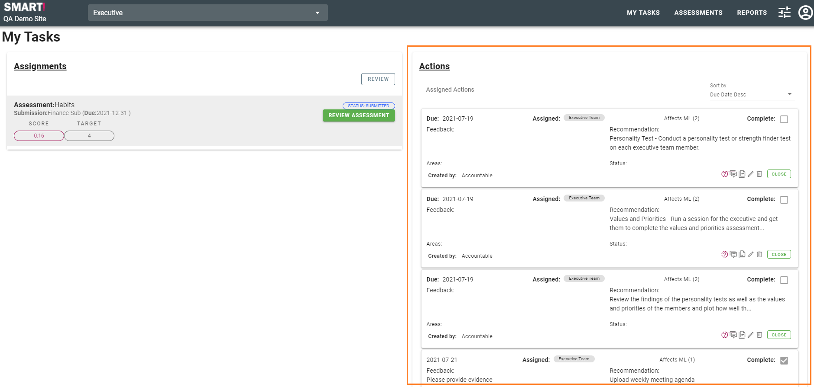

# Actions
Actions are items which have been identified to close the gap between current performance and desired performance.

All actions a user is accountable for, or assigned to, are shown in the Actions section of the My Tasks page.

