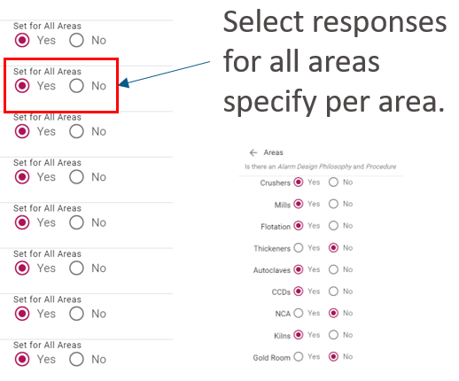

# Areas

Areas can be added to a team. These can represent functional areas or departments that the team is responsible for. If these areas are enabled for the assessment they can be accessed via the   icon on the question screen.

  
When answering questions on an assessment with areas enabled.

clicking on the "Yes" or "No" on the main question screen will set all areas to that response. Alternatively, you can set responses for each area, as shown above.

Progress is saved as you answer the questions so if something happens your work will not be lost.