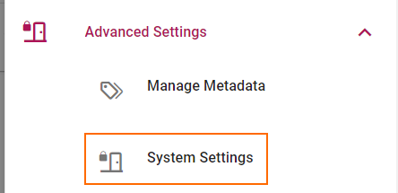
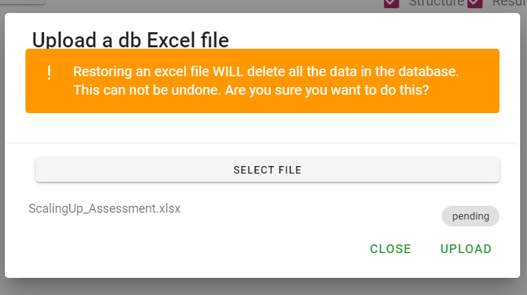
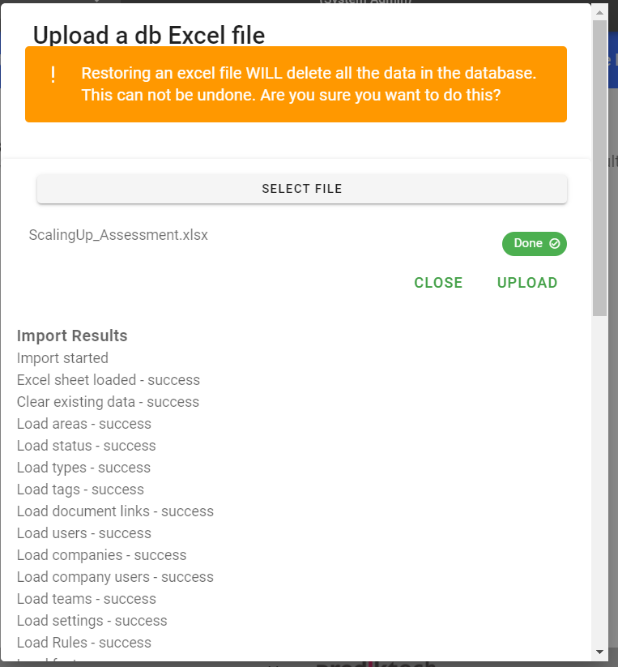

# Database Reset
There are times particularly during the setup of a new system or during testing when you want to rest the entire system.

SMART! provides the ability to import and export data from the system.

### Navigate to the Import / Export screen 
1. Log in as the system admin.
1. Navigate to the "Advanced Settings > System Settings" menu option.

1. On the left hand side of the screen click on the DB Reset Icon .

## Export
Exporting from a SMART! instance allows you to download the configuration structure and data in the system to an excel file. This file can be used to sve a specific state as a restore point, used to migrate the system to another instance or in order to make bulk modifications to a system. 

### Exporting
1. There are two export options, structure and results.
    1. Structure will export all the settings and configuration. This includes standards, requirements, questions, qualities, assessments, companies, users, teams and so on.
    1. Results will export that actual user input, answered questions, comments, actions, evidence entries, objectives, initiatives and so on.
    **NB** uploaded files will not be exported. Files are stored in Azure storage containers and they need to be handled separately.
1.  Select what needs to be exported (Structure and/or Resutls).
1. Click on the "Export / Backup Database" button.
1. Click ok on the confirm dialog. Depending on the size of the database it may take a while for the export to complete. Wait for the download to complete and your browser will inform you when it is done.
1. In your download folder you should see a file like "SMARTi-Export-2021-08-09.xlsx"

## Import
Importing data allows you to reset the system back to a known state or initialise a new system with assessments that have been configured in excel. 

Importing a previous export. This is helpful to put the system back in to a known state or to migrate data to a new instance of SMART!.

### Importing
1. Click on the "Import DB Excel" button. (The structure and results options do not affect the import. What is imported is only determined by the content of the spreadsheet)
1. You will be prompted to select a import file.
1. Choose the file to be imported.
1. Once the file is selected it will be in a "pending" state. 
1. When you are ready click on the "UPLOAD" button.
1. Click ok when prompted.
1. The status will change to "UPLOADING", please wait for it to complete.
1. When the upload is done the status will either be "DONE" with a tick or "ERROR".
1. in either case if you scroll down more information is provided about the import and you can validate that all the content was successfully imported.

