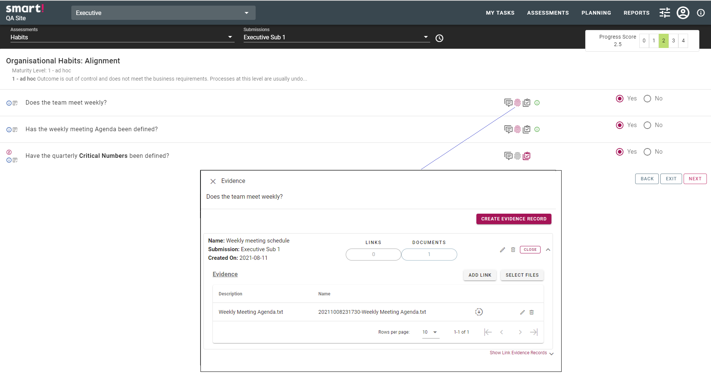
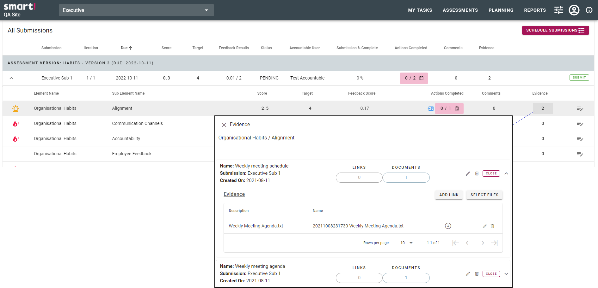

# Evidence
Documentation which supports the answer given. This may take the form of a link or a file. An evidence record must first be created, then the link or file added. The evidence record may be linked to one or multiple questions.

Evidence records may be viewed individually through the submission when completing by clicking on the evidence icon  for the question.

 
Or by reviewing the submission and clicking on the displayed number of evidence records.  
 