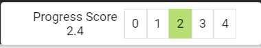

# Maturity Scoring 

The maturity score indicates compliance to the questions within the maturity levels. The maturity level needs to be completed before the score will indicate achievement of that maturity level. In the below image a progress score of 2.4 indicates that maturity level 2 and below are totally compliant. Then the 0.4 indicates that 40% of maturity level 3 is compliant. 

>NB: Answers for higher-level maturity levels are not shown and do not affect the score until the current maturity level has been completed. (Reports are able to extract these additional results if they are needed).

As questions are answered within the assessment, a progress score is calculated and displayed in the right-hand area of the assessment screen.

## Advanced
It is possible within the system to configure a threshold per maturity level. By default the system requires 100% compliance to a maturity level before it is considered achieved. You could set each maturity level to have a different compliance threshold. Level 2 for example could be set to 0.7 meaning that only 70% of the questions need to be answered _YES_ for the maturity level to be considered as achieved. 
> CAUTION: Using these thresholds could make the scoring difficult to keep track of and therefore should be used very carefully.