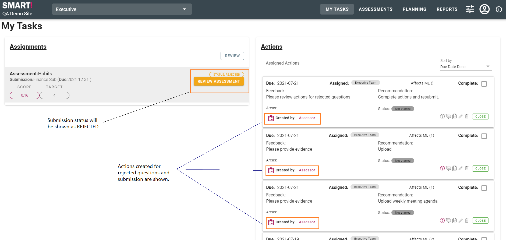
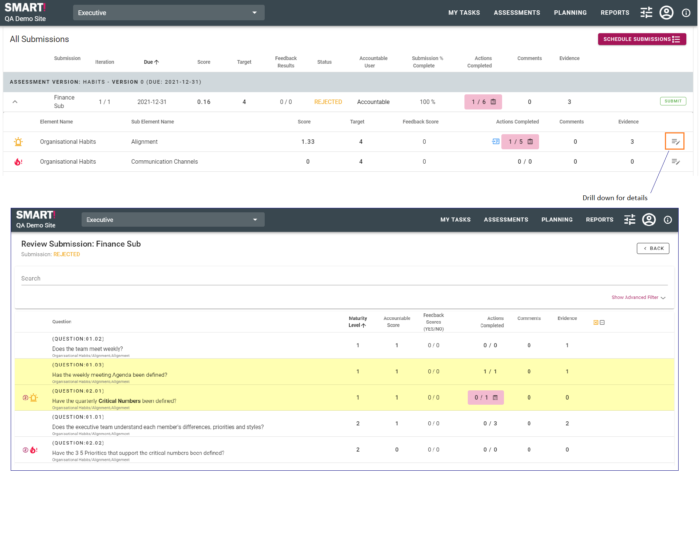
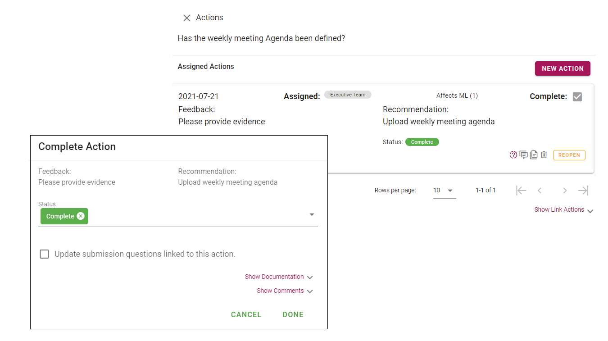
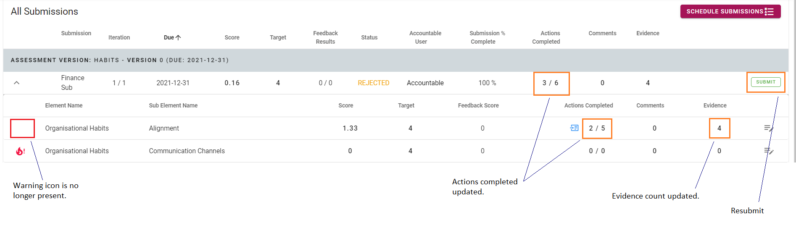

# Rejected submission
A submission, or answers within a submission, may be rejected. This will be highlighted in the Assignments and Actions areas of the My Tasks page, as shown below.  
  

>NB: Best practice is for the Accountable and Assessor users to review the submissions together, so minor issues can be resolved immediately, e.g., uploading evidence.

Actions may be addressed via the review screen.

In this example, one of the actions from the rejection asked for evidence to be uploaded. Once this has been completed, the action can be closed.

Once all actions are dealt with, the submission can be resubmitted.
