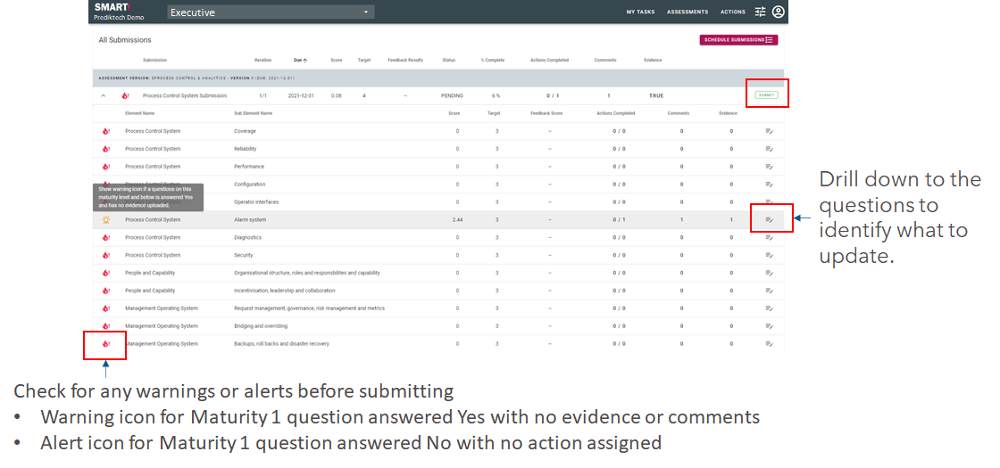
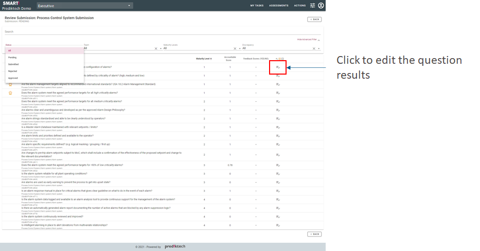

# Review assessment before submitting for approval

All submissions can be found and updated with additional comments, evidence and actions in the review tab. The review tab highlights issues to be corrected prior to submission.

The submission can be expanded to display all the sections that have been configured to be assessed.

Create an action or add comments and evidence for the non-conforming question.

## Next Steps
- Complete the submission identifying the necessary evidence and creating improvement actions.
- Submit the submission for review.
- Submission is reviewed by the assessor.
- Submission review meeting is scheduled to confirm the results and actions.
- Follow-up actions may be required.
- Submission is closed.
- Results and actions are consolidated and presented to the appropriate personnel (this may be across multiple levels/groups/sites within the organisation). 