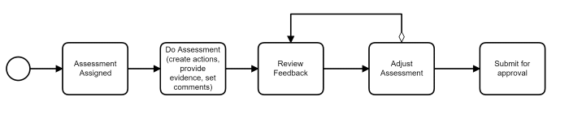
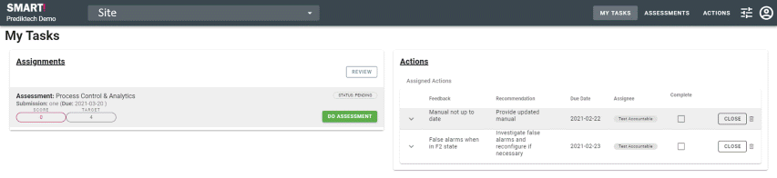
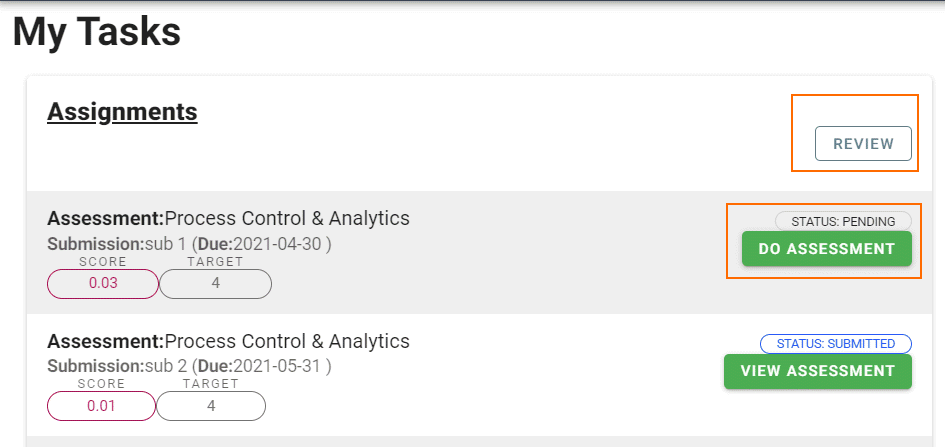

# Accountable 
The SMART! application embraces the notion that if more than one person is accountable then _**no one**_ is accountable.

Therefore a single person is configured as being accountable within a team. This team can then be assigned to submissions within assessments and/or initiatives and that person is the one held accountable for the results. 
 
The accountable user will complete assigned submissions. They will attach evidence or provide comments for items of compliance as well as creating actions to close identified gaps. The accountable person is held responsible for the compliance and maturity improvement for the assigned submissions. Once they have completed the submission they are able to "Submit" and perform a review in collaboration with the Assessor.

## Tasks
- [Completing submissions](/jobs/completing-an-assessment.html)
- [Reviewing feedback provided on submissions](/jobs/review-feedback.html)
- Endorsing and communicating the plan to the team and feedback users.
- [Maintaining the status of actions](/jobs/updating-actions.html) required to close identified gaps.
- [Uploading evidence](/jobs/upload-evidence.html) to prove compliance to specific assessment questions.
- Updating [Key Results](/jobs/key-results.html) for initiatives assigned.

## Workflow

When you first log into the application you will be shown the "My Tasks" dashboard. Here you can see submissions that you are either accountable for or have been requested to provide feedback for.

You know you are accountable for a submission if you can see the "Do Assessment" button on the submission and you have a "REVIEW" button on the assignments section.

**Assignments:** This means you have been assigned submissions within an assessment. You start completing the assigned submission by clicking on the "DO ASSESSMENT" button or by clicking on the "ASSESSMENTS/COMPLETE" menu option on the top of the page.  

**Actions:** This means you have actions assigned to you and are accountable for their completion.