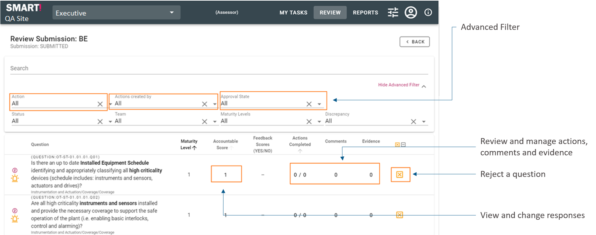
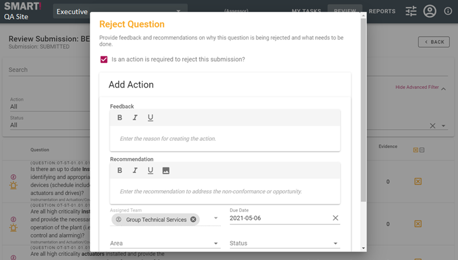
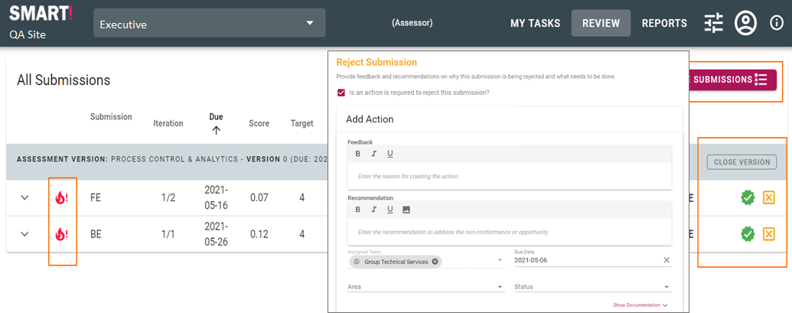
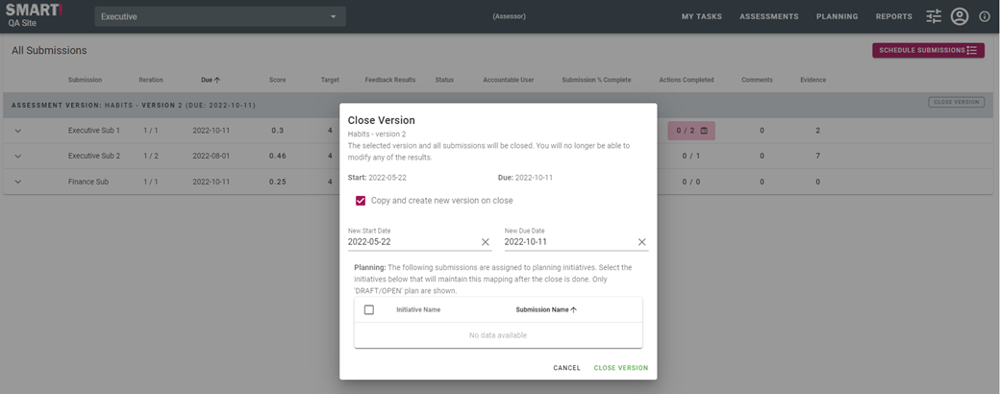

# Review a submission
The submission can be expanded to display all the sections that have been configured to be assessed.

At each level of the submission you are able to see what actions, comments and evidence has been added to that section of the assessment, and accountable and feedback scores. You are able to access these items by clicking on the number, this will cause a window to be displayed at the right of the screen.

Click on the section details to review individual questions.

## Review Question Details

The details of each section can be reviewed. This allows advanced filtering of all questions in the section as well as managing the responses, actions, comments and evidence for each question.

## Manage Responses
The accountable response shown on the detail page also allows the user to change the response by clicking on the score.

Best practice is for the assessor and accountable user to perform the review together. In this case, as they discuss each question it may be required to adjust the score without “retracting” or “rejecting” the submission. The response can easily be adjusted here.

If areas are enabled you are able to expand the response row and adjust responses per area.

## Reject Question
If there is something wrong with the response to a question, the question requires additional evidence or an action is required then the question can be rejected.

All rejections require that an action be created. This is because you need to inform the accountable user what the reason for the rejection is. This allows you to track progress as actions are completed.

Rejecting an entire submission allows the option of not creating an action but in that case, it is assumed actions have been created at the question level. 

It is best practice to have a conversation with the accountable user as well as create actions to ensure there is a clear understanding as to the reason for the rejection, and the actions required for the submission to be approved.

## Approve / Reject Submission
Once the review is completed it is time to Approve  or Reject  the submission.

Rejecting an entire submission will prompt you to create an action as shown below.

Approving a submission will set the submission into an **APPROVED** state. It is possible to set a submission to allow multiple iterations per version. If this is the case and another iteration is required it will be created and placed in a **PENDING** state.

## Close Version
The assessor can close a version at any point in time, but this would normally happen after the submissions in that version have been completed and approved.

Click close version.

The assessor can choose to simply close the version and not create a new version. This can be done manually at a later date through the _Schedule Submissions_ screen.

Or, (**recommended**) the assessor creates a new version by leaving the “Copy and create new version on close” box ticked. The details for the new version can easily be modified at a later date.

After the version has been closed the old closed version is no longer displayed on the review screen.

After close, the new version with new submissions will be displayed. The new version will have the results, open actions and open evidence records copied over to the new version.

## Review Steps
- Submission review meeting is scheduled between the assessor and accountable user to confirm the results, actions created and evidence provided.
- During the review question responses may be adjusted, actions created, comments added and evidence supplied.
- The question can be rejected if the required information is not currently available, with an action then created as a reminder to close the gap.
- After the review the actions created are the plan for the next iteration of the assessment.
- The submission can now be Approved or Rejected if it is in a totally unfit state.
- Repeat for additional submissions.
- Once all submissions have been reviewed the version can be closed.
- Track progress.
- Results and actions are consolidated and presented to Site and Group levels.
- Repeat.