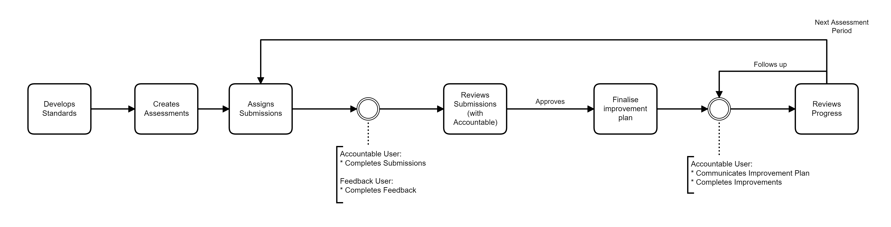
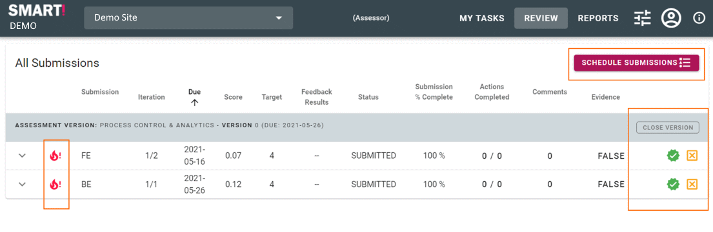

# Assessor 
One of the primary responsibilities of the Assessor is to review assessments that have been submitted. An assessor does not complete assessments and cannot be assigned assessments. They are, however, able to review and adjust submissions as required.

> NB: An assessor is able to modify responses on behalf of the accountable person. The assessor is also able to add actions, comments and evidence as needed.

## Tasks
- [Define required submissions](/jobs/define-submissions.html)
- [Define the submission frequency and due dates](/jobs/define-submissions.html)
- [Assign accountable teams to submissions](/jobs/define-submissions.html)
- [Request feedback on a specific submission](/jobs/define-submissions.html)
- Complete an assessment on behalf of the accountable person (Observation)
- [Review the submissions once complete](/jobs/assessor-review.html) (in collaboration with the accountable person)
  - Adjust submission responses, add additional actions, comments and evidence
  - Approve or reject individual questions and/or submissions
- _[Planner role]_ [Create a plan](/jobs/plan.html) to close the identified gaps.
- [Close a version](/jobs/assessor-review.html)
- Follow up on improvement actions

## Workflow

 
## Review
When you first log into the application you will be shown the "Review" screen. This will show all the assessments available for review.
The review tab highlights issues to be corrected prior to submission approval.

**Alerts:** These alerts are provided to highlight if 2nd Line of Assurance (High Risk) questions have been completed correctly. _(see [Second Line Assurance](/concepts/second-line-assurance.html) for more details)_

Assessors will likely have the ability to create assessment submissions, allocate those submissions and then review the results when they have been completed.

Approved submissions will contain a number of actions that have been agreed upon between the organisation, accountable user and the assessor. These actions form the "Maturity Plan" for the next period. If the planning module is enabled and the assessor has planning rights they can also create detailed plans to track and prioritise the maturity activities.