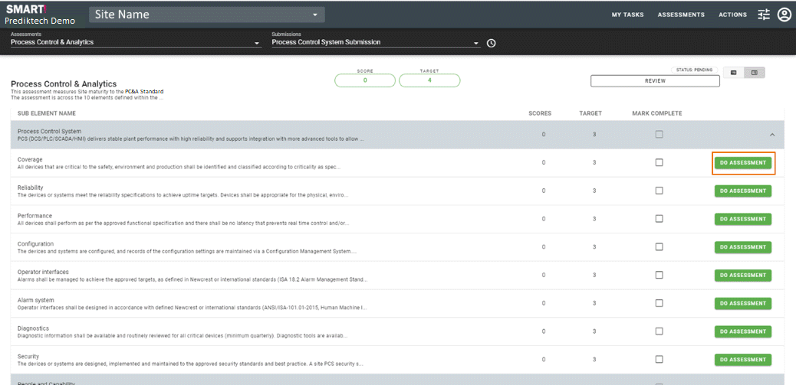
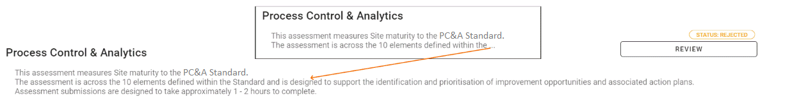
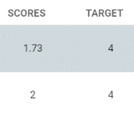
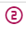
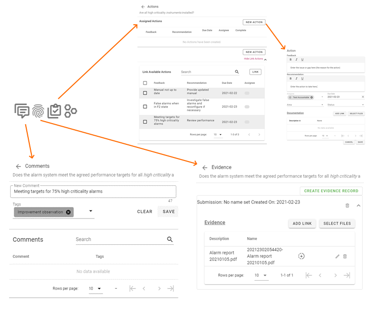
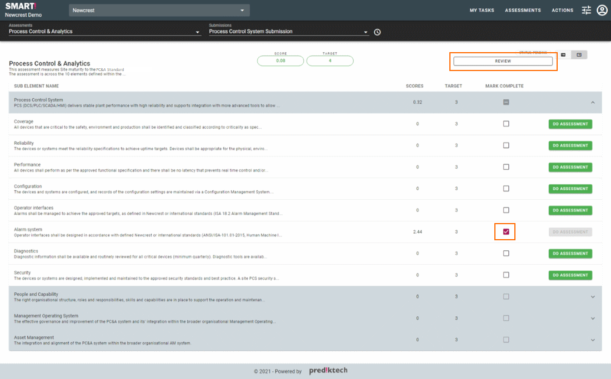

# Completing an assessment
Click on the _DO ASSESSMENT_ button from the My Tasks dashboard or from the menu bar select _ASSESSMENT_ and then click _COMPLETE._ You will be shown the assessment details that can be completed.

Click on the _"DO ASSESSMENT"_ button to work on that section of the assessment. Once you have answered all the questions you are able to for this submission click on the "MARK COMPLETE" check box next to the _"DO ASSESSMENT"_ button to indicate that you are done with that section.

The _"Submission % Complete"_ on the review screen is determined by the number of sections you have marked as _"Complete"_.

Starting from the top left of the screen you are able to select the assessment and the submission that has been assigned to you as a user.

You can see the assessment name and description. (If the description is longer than the space available you will see **...** this indicates that the description has been truncated. You can simply click on the description to see the full description)

Clicking on the score or target will show a dialog with the description for the maturity level.

You are also able to click on any of the maturity level items on the score widget to get a detailed description of what that maturity level is.

## Answering Questions
Once you have entered the assessment questions page you are shown a list of questions for a specific maturity level. Assessments can have one or more maturity levels.

Once you are able to answer all questions on a maturity level as "Yes" then the maturity score will increase. Whilst undertaking a submission, the progress score is displayed in the top right of the window. A score of 2.4 for instance indicates that you are currently on a maturity level 2 and you have answered 40% of the maturity level 3 questions as "Yes". Answers for higher-level maturity levels are not shown and do not affect the score until the current maturity level has been completed. (Reports are able to extract these additional results if they are needed).

[2nd Line Assurance](/concepts/second-line-assurance.html) questions display a specific  icon to identify them.

The requirements linked to a specific question can be accessed by clicking on the  icon next to the quality name.

Answering the question is only the first piece of completing the submission.

If you answer **Yes** to a question it is recommended that you also provide **evidence** to support your answer, or at least a comment, particularly if you are providing feedback.

If you answer **No** to a question it is recommended that you create an **action** to indicate how this situation will be resolved in the future.

See below the icons available for each question that allows you to add Comments, Evidence and Actions respectively. (The final icon indicates areas are active on this submission, see [Areas](/concepts/areas.html).)

Click on "NEXT" to keep going with the submission or "EXIT" to return to the Assessment summary page.

## Finalising an Assessment (Submission)
Once all questions that can be answered have been answered (including uploading relevant evidence and creating actions and comments), mark that section of the assessment as **Complete**.

The % complete of this submission is calculated based on the number of items marked as complete.

Click on the REVIEW button once done to review the submissions assigned to you as well as submit the submissions for approval.

### Next Step
[Review Submission](/jobs/acc-review-before-submit.html)

## Additional items
- [What is second line assurance and why am I getting errors or warnings?](/concepts/second-line-assurance.html)
- [Actions](/concepts/actions.html)
- [Evidence](/concepts/evidence.html)
- [Comments](/concepts/comments.html)