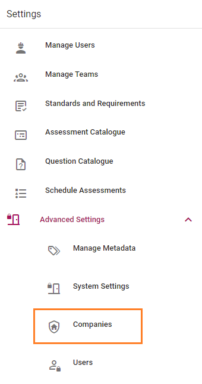
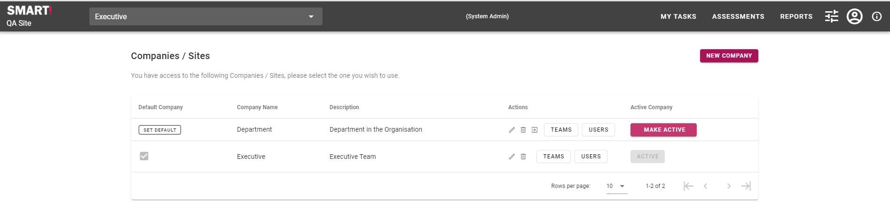
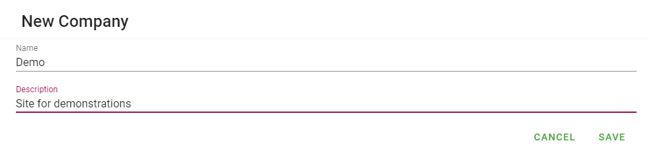
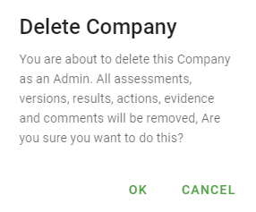
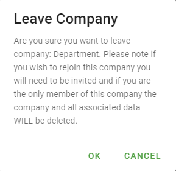
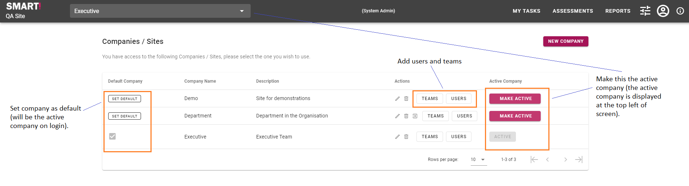

# Configure companies
>Companies are set up and managed by a system administrator.

1. Login as the system administrator.
1. From the menu, select Settings -> Advanced Settings -> Companies

This will display the following page.

## Add new company
To add a new company, click _NEW COMPANY_.
Give the company a name and description, and click _SAVE_.

The newly added company will appear in the list.

## Edit company
To edit a company, click on the edit icon . Edit company title and description, then click OK.

## Delete company
To delete a company, click on the delete icon . You will be asked to confirm the deletion.
 Click OK to confirm.

## Leave company
To leave a company, click on the  icon. You will be prompted to confirm leaving the company.

Click OK to confirm.

## Set as default, make active, add teams and users
Click the appropriate buttons to set the company as default, make active, and add teams and users.

For more information on adding teams and users, see [Manage Users and Teams](/jobs/manage-users.html).
