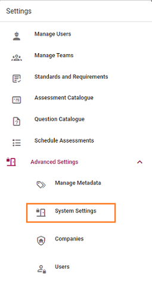
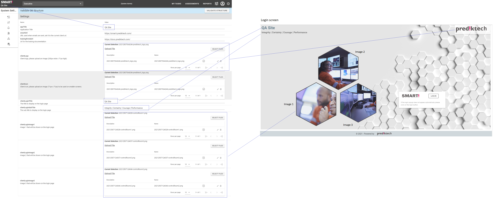

# Configuring SMART! instance and display
Each SMART! instance is able to be configured and customised. This may be completed by a system administrator from the System Settings page

1. Log in as a system administrator.
1. Browse to Settings -> Advanced Settings -> System Settings.

1. Modify fields, as required.

    The following fields are basic customisation of the display.
    1. Application title - shown in the top left corner of all pages once logged in.
    1. Client logo - displayed top right of login screen
    1. Login title - displayed top left of login screen
    1. Login subtitle - displayed underneath login title
    1. Login images - three hexagons, displayed at left of login screen
    
   Changes will be saved automatically.

