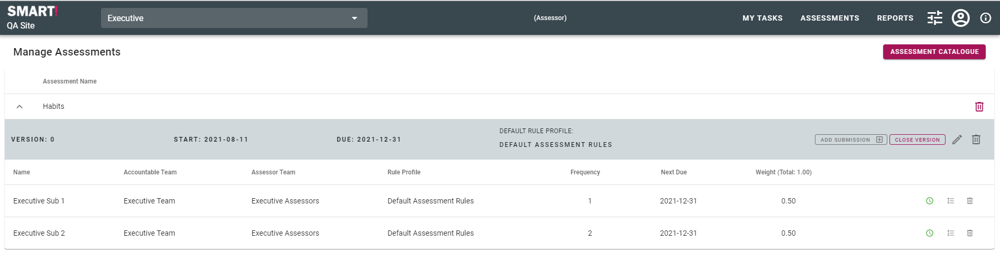
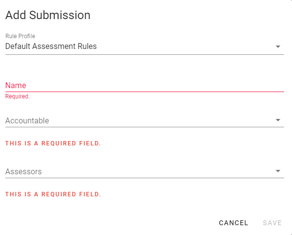
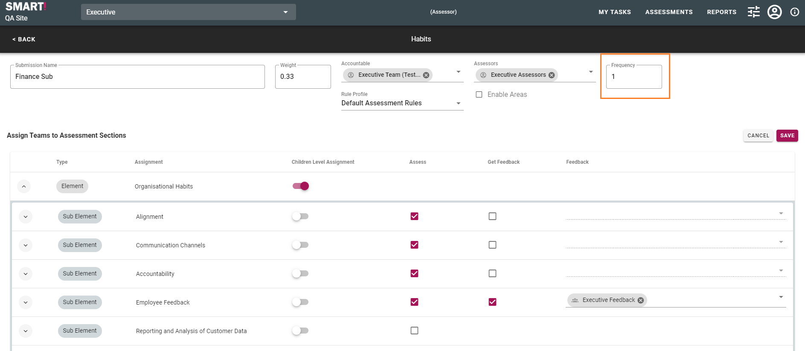
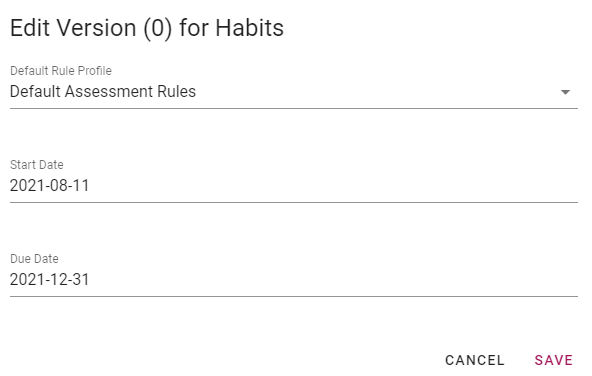
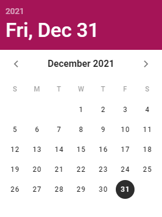
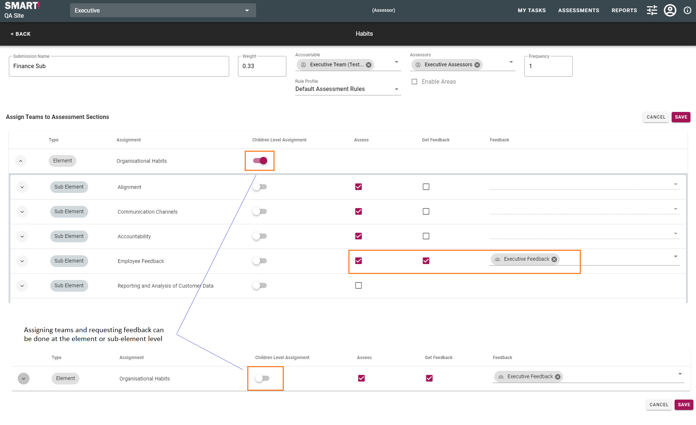

# Defining Submissions
Creating or editing a subsmission is completed via the Assessment Catalogue. This is also where teams are assigned and feedback is requested. 

The Assessment Catalogue can be accessed from the menu bar, selecting Settings -> Assessment Catalogue, then clicking the _SCHEDULE_ button, or selecting Settings -> Schedule Assessments.

## Add Submission
You can add a submission to the current version of an assessment by clicking _ADD SUBMISSION_.

Fill in the fields and click _SAVE_ when done. 

_For information on rule profiles, see [Rule Profiles](/jobs/rule-profiles.html)._

## Edit Submission
Click the schedule icon  next to the submission.

Make required changes, and click _SAVE_ when done.

## Define Submission Frequency 

Click the schedule icon  next to the submission.

The submission frequency refers to the number of iterations of a submission that make up a version of an assessment. ``For example...``

## Define due date
The due date for each submission is automatically calculated based on the due date of the version and the submission frequency.

Start and due dates for assessment versions may be edited by clicking the edit icon  next to the relevant version.

Click on the date and use the calendar to select the new Start/Due date.

## Assign Teams and Request Feedback 

Click the schedule icon  next to the submission.

Assigning teams to complete the submission and requesting feedback may be done at an element (team is responsible for completing all elements within the submission) or sub-element level (team is responsible for completing only selected sub-elements).

Click _SAVE_ when done.
