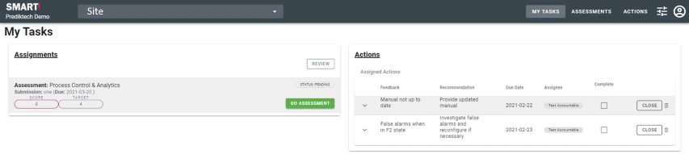

# Feedback 
The feedback journey is used to gather information from people who are not accountable for a specific submission.

A user in the system can be requested to provide feedback on one submission and be accountable on another. 

Feedback users are able to answer questions and provide comments. The feedback provided is then considered by the Accountable user and Assessor while they review the submission.

>NB: if you are a feedback user on a submission you will not see that submission on the 'Review' screen.

## Tasks
- Answer questions on specific submissions
- Provide comments to justify the answer given
- View actions that have been created
- Add comments to existing actions
- View the evidence records that have been created

## Workflow

When you first log into the application you will be shown the "My Tasks" dashboard. Here you can see submissions that you are either accountable for or have been requested to provide feedback for.

You know you have been assigned to give feedback for a submission if you can see the "Give Feedback" button on the submission.

**Assignments:** This means you have been assigned to give feedback on submissions within an assessment. You start completing the assigned submission by clicking on the "GIVE FEEDBACK" button or by clicking on the "ASSESSMENTS/COMPLETE" menu option on the top of the page.  

**Actions:** This area shows all actions within the submissions that have been assigned to you for feedback. Note that the feedback user is _not_ accountable for the completion of actions.