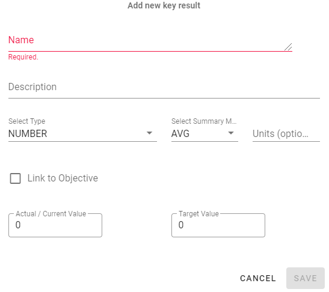

# Key Results

## Add new

To add a new key result, click on _NEW KEY RESULT_.

The type and summary method for the key results must be selected. Units are optional.  
 
Type: number, percent, boolean (yes/no), or rating.   
Summary method: average or sum.

Click _SAVE_ when done.

## Update  

To update a key result, select the desired key result and modify values.

If a key result forms part of a maturity plan, the value(s) will be derived from the linked assessment, so the actual/current value will be updated as the assessment is updated (completing assigned actions and updating answers). Only target values are able to be modified directly. 
