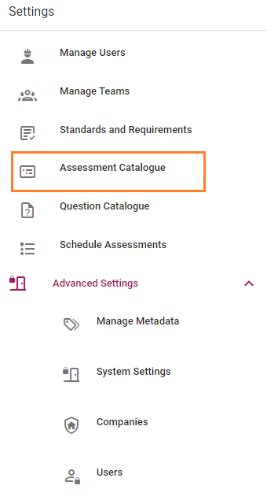
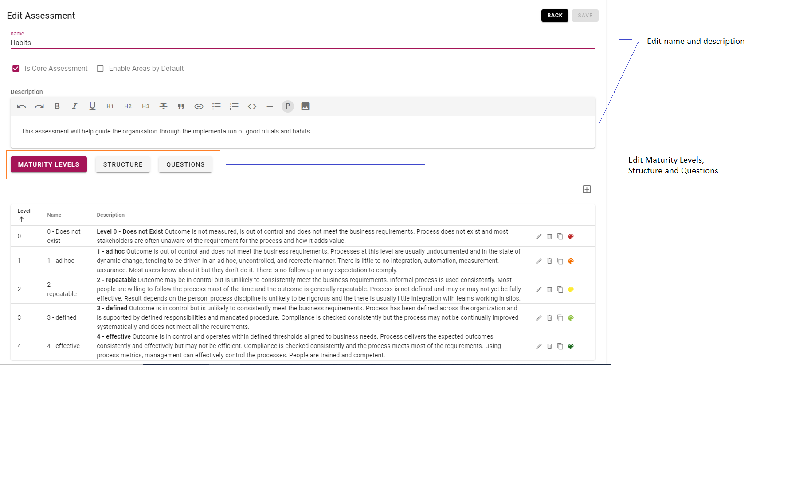
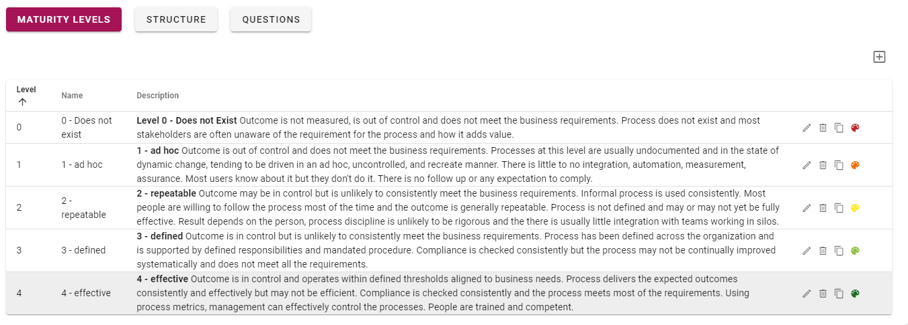

# Managing Assessments

>Assessments are only able to be managed by system administrators.

Managing assessments is completed via the Assessment Catalogue, which is access from the menu Settings -> Assessment Catalogue.

All configured assessments will be shown on the Assessments page. To edit click the  icon.

Title and Description of the assessment can be modified by typing in the text areas.

If you make any changes, you will be prompted to save.

You are able to select if the assessment is core (the assessment can only be copied, not changed) and to enable areas by default via the check boxes below the assessment name.

## Managing Maturity Levels

