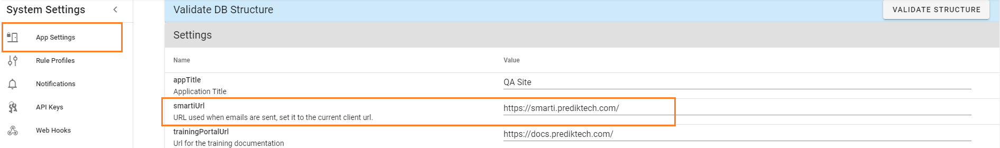
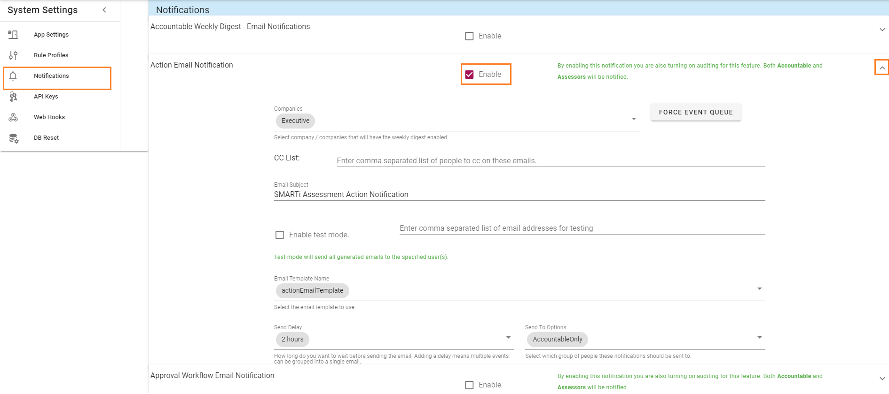

# Manage Notifications
>Note: Email notifications can only be set up and modified by system administrators.

Notifications are managed within System Settings. Browse to _Settings -> Advanced Settings -> System Settings_.

## Set url
Within App Settings, set the url from which emails will be sent. Click on the text and type.

## Enable and configure notifications
Within Notifications, click the checkbox against the desired notifications to enable.

Modify default settings, as required.  
**Company**: select from the drop down list.  
**CC List**:Add email addresses which will receive CC of the emails.  
**Email subject** is automatically populated, however, you may edit this field.  
**Email template** is automatically populated, however, you may change the template by selecting from the drop down menu.  
**Send Delay**: select the desired option from the drop down menu.  
**Send To Options**: select the group of people to receive the notification emails from the drop down menu.

### Test mode
Enabling the test mode allows you to send all generated emails to a specified list of email addresses. Click the check box to enable, and type the list of email addresses to receive the test emails.

### Force Event Queue
Clicking the _FORCE EVENT QUEUE_ button will send all configured emails to send immediately. Click _OK_ to confirm.

