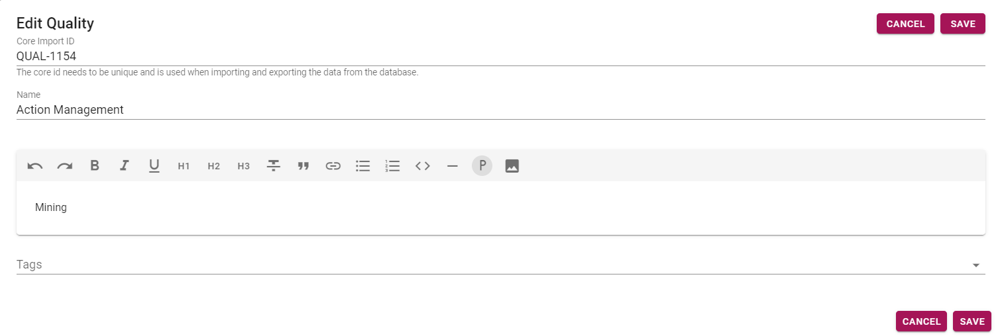
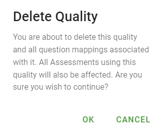
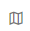
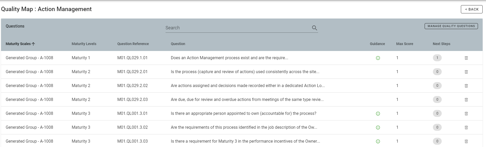
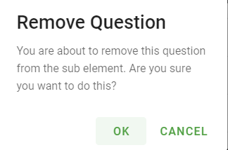
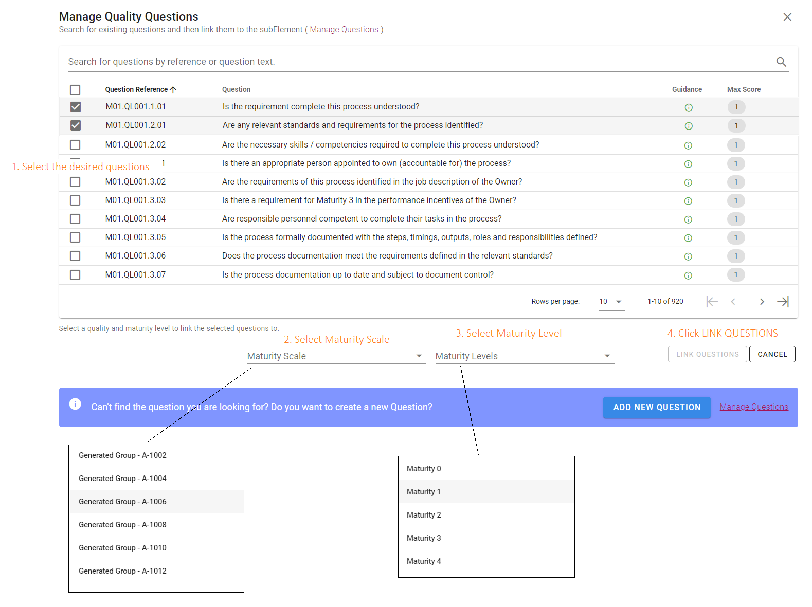
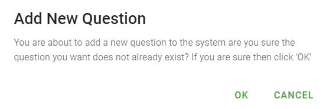
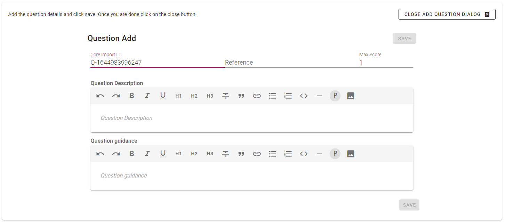

# Managing Qualities
>Qualities are only able to be managed by system administrators.

Managing qualities is completed via the Qualities page, which is accessed from the menu via Settings -> Qualities.

All configured qualities will be displayed. You are able to sort qualities (ascending or descending) by name and description. To sort, click on the desired criteria. Click again to reverse the order. You may also search for qualities using the search bar. Qualities are able to be edited and deleted via the icons. 

## Edit Quality
To edit a quality, click the pencil icon. This will open the following dialog.

The following fields are available: Core Import Id, Name, Description, Tags.  
**Core Import Id** - A unique id used when importing and exporting data from the database.  
**Name** - Quality name  
**Description** - Quality description  
**Tags** - Used as groupings for items (tags are selected from the configured list, or you can add more via [Manage Tags](/jobs/manage-tags.md)).
Once changes have been made, click the _SAVE_ button.  

## Delete Quality
To delete a quality, click the delete icon . This will open a confirm dialog. 

Click _OK_ to confirm deletion, or _CANCEL_ to cancel.

## Maturity Level Quality Map  
The maturity level quality map may be shown by clicking on the map icon for the desired quality.   
This will open the Quality Map page for that quality.

The questions may be filtered by using the Search bar.

Questions may be deleted via the delete icon.   
You will be asked to confirm deletion.   
Click _OK_ to confirm deletion, or _CANCEL_ to cancel.

## Manage Quality Questions
Click _MANAGE QUALITY QUESTIONS_ to map questions to qualities.

1. Select desired questions from the existing list (or add new question via the button at the bottom of the dialog).
1. Select the desired Maturity Scale from the drop down list.
1. Select the desired Maturity Level from the drop down list
1. Click _LINK QUESTIONS_. (_Note: This button will become available once maturity scale and maturity level have been set._)

## Add new question
Click on the _ADD NEW QUESTION_ button.
You will be asked to confirm.

Click _OK_ to confirm, or _CANCEL_ to cancel.  
Confirmation will open the Add Question Dialog.

The core import id is automatically generated. Add details for:
* Reference - question numbering
* Question description - the question itself
* Question guidance - further information which may be helpful in answering the question
Click _SAVE_ when done.
Click _CLOSE ADD QUESTION DIALOG_ to return to the Manage Quality Questions dialog.
