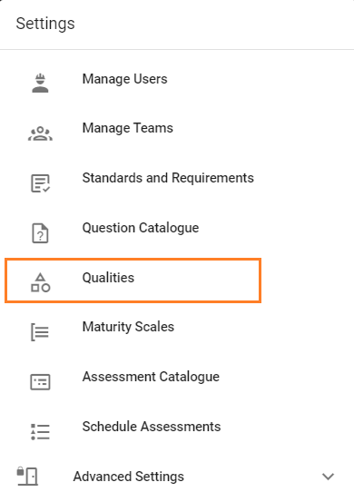
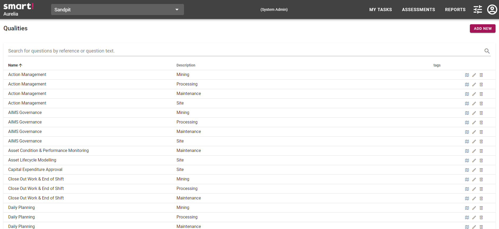

# Managing Qualities
>Qualities are only able to be managed by system administrators.

Managing qualities is completed via the Qualities page, which is accessed from the menu via Settings -> Qualities.

All configured qualities will be displayed. You are able to sort qualities (ascending or descending) by name and description. To sort, click on the desired criteria. Click again to reverse the order. You may also search for questions using the search bar. Qualities are able to be edited and deleted via the icons. 

The maturity level quality map may be shown by clicking on the map icon.
