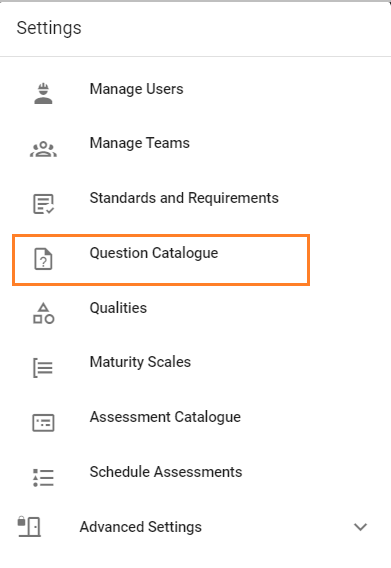

# Managing Questions
>Questions are only able to be managed by system administrators.

Managing questions is completed via the Question Catalogue, which is accessed from the menu via Settings -> Question Catalogue.

All configured questions will be displayed. You are able to sort questions (ascending or descending)by requirement, reference, question text, maximum score, and number of next steps. To sort, click on the desired criteria. Click again to reverse the order. You may also search for questions using the search bar. Questions are able to be edited, deleted, and copied via the icons. 

## Add new
New questions may be added by clicking _ADD NEW_.

Fill in the fields as prompted and click _SAVE_ when done. This will create the question and allow you to add further information - linking the question to standards and adding next steps. 

``Next steps`` are the actions which have been determined necessary to address the identified gap between current and desired performance. 

### Link requirement
To link or map a standard, select the standard from the drop down menu. Then select the requirement from the drop down menu. Click _MAP_. This links the requirement to the question. To remove this link, click the delete icon .

### Add next step
To add next steps, click the plus icon .
Add name for the next step, and click _SAVE_.

Once created, you will be able to add further detail for the next step: description, add link or file.

To upload a file, browse to the file, click _OPEN_. The file will be displayed as _pending_. Click _UPLOAD_.

If a file is uploaded, a checkmark will be displayed in the Documentation field.

Files may be downloaded and links copied or browsed to by clicking the relevant icons.
