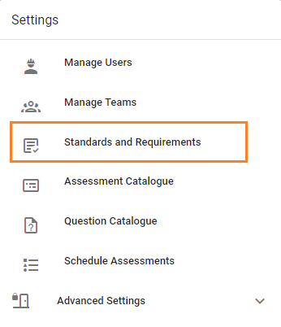
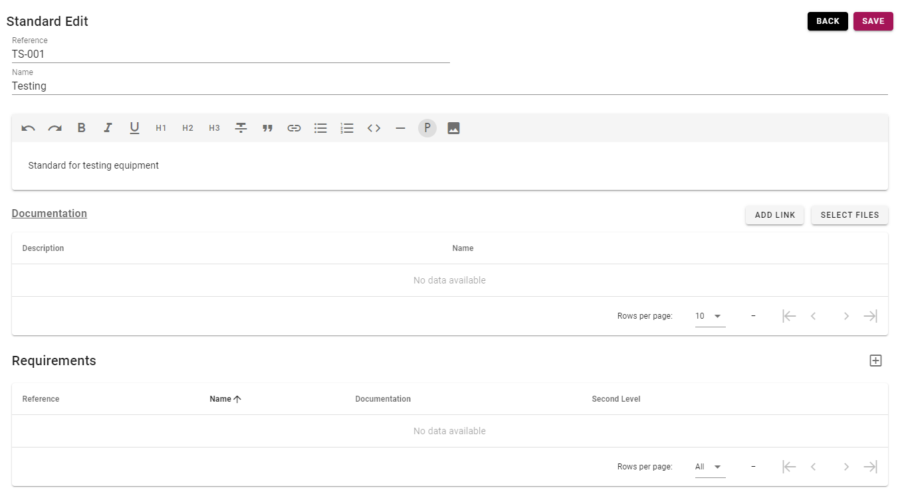
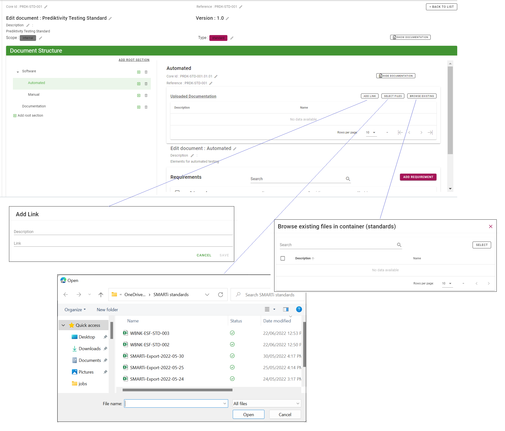
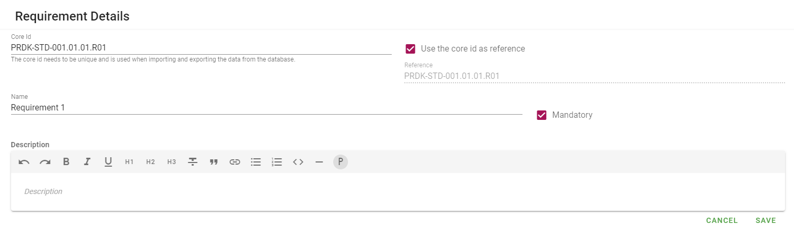

# Managing Standards and Requirements

>Standards are only able to be managed by system administrators.

Managing standards and requirements is completed via Standards and Requirements, which is accessed from the menu Settings -> Standards and Requirements.

Requirements form part of a standard, and are accessed when adding or editing a standard.

## Add Standard
1. To add a new standard, click _ADD NEW_.
1. Fill in details (reference, name and description), click SAVE.
This creates the new standard and allows you to add documentation and requirements.

1. To add documentation (link or file) click _ADD LINK_ or _SELECT FILE_. This will open a dialogue prompt.

    1. For a **link**, add link name and url, and click _SAVE_.
    1. For a **file**, browse to the file, click _OPEN_. The selected file will be displayed as _pending_. Click _UPLOAD_. This completes the upload process.  
1. Click _SAVE_ when finished. This completes adding the new standard. 

## Add Requirement
1. To add requirements, open (add or edit) the relevant standard. Click the plus icon  to the right of the Requirements section. Fill in details (reference, name, and description), click _SAVE_. This creates the requirement and allows you to add documentation and map the requirement to assessment questions, once linked to an assessment.  

1. A requirement may be marked as "2nd Line" by ticking the check box. The check box is a flag that this requirement is assessable by the business (internal) assurance teams. For more details, refer to [Second Line Assurance](../concepts/second-line-assurance.html).
1. Click _SAVE_ when done. This completes adding a requirement. 

