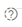

# Managing Documentation - Standards, Policies and Procedures

>Doucmentation (standards, policies, procedures, etc.) is only able to be managed by system administrators.

Documentation is accessed from the main menu _Menu -> Documentation_.

Requirements form part of a standard, and are accessed when adding or editing a standard.

## Add Standard / Policy / Procedure
1. To add a new piece of documentation, click _ADD NEW_.
1. Fill in details (reference, name, description, version, scope and type), click SAVE.
This creates the new document. 

Now you can create the structure of the document, adding requirements, linking questions, etc.
1. To build the structure of the document, click edit.

Now you can add sections and subsections

1. To add documentation (link or file) click _SHOW DOCUMENTATION_, then use the _ADD LINK_ / _SELECT FILES_ / _USE EXISTING_ buttons. This will open a dialogue prompt.

    1. For a **link**, add link name and url, and click _SAVE_.
    1. For a **file**, browse to the file, click _OPEN_. The selected file will be displayed as _pending_. Click _UPLOAD_. This completes the upload process.
    1. To use a previously uploaded file, click _BROWSE EXISTING_, select the desired file. Click _SELECT_.  
1. Remember to click _SAVE_ when done editing any part of the documentation.
Changes to structural components (elements, sub-elements, requirements, etc.) are saved automatically.

## Add Requirement
1. To add requirements, open (or edit) the relevant documention. Navigate to the location within the doucmentation (e.g., element, sub-element) then click _ADD REQUIREMENT_. Fill in details (reference, name, and description), click _SAVE_. This creates the requirement and allows you to add documentation, map the requirement to questions.  

1. A requirement may be marked as "Mandatory" by ticking the check box. The check box is a flag that this requirement is assessable by the business (internal) assurance teams. For more details, refer to [Second Line Assurance](../concepts/second-line-assurance.md).

You may attach links or files to a requirement. You may also add questions.
To add a link or file, click the _Show Documentation_ icon .
This functions the same as above.

To add or link a question, click on the question icon .
From here, you may search for existing questions using the search bar, or add a question.
Clicking _ADD QUESTION_ will open the dialog as shown.

To select from existing questions, use the search facility to locate the desired question(s), then check the relevant box(es). Click _LINK QUESTIONS_ when done.
If the desired question does not already exist, you may add a new question via the _ADD QUESTION_ button.

Add question details and guidance, click _SAVE_, then _CLOSE ADD QUESTION DETAIL_.
You can then search for the question from the list, then link.