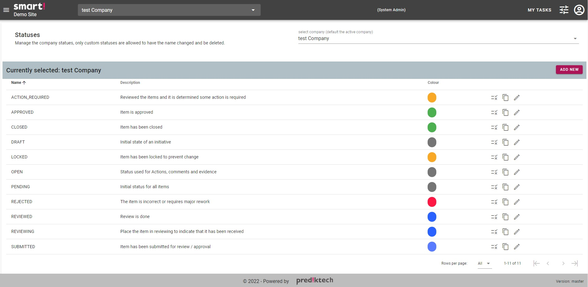
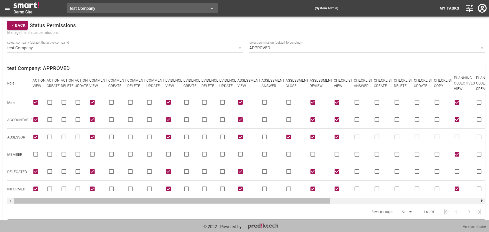
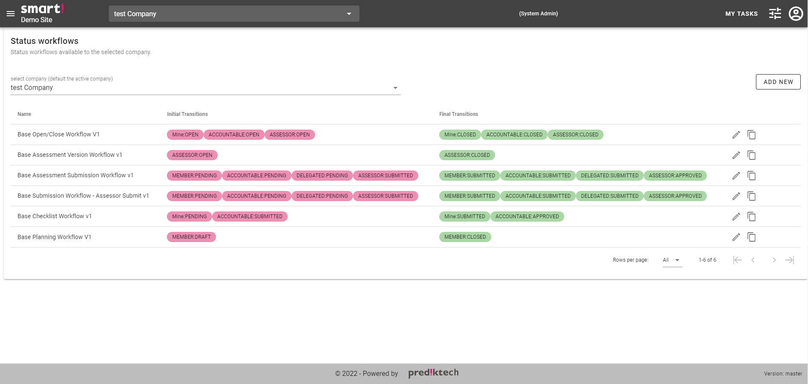

# Managing Status and workflows

** You must be a System Admin to manage status and workflows **

All users are able to view statuses and workflows.

Statuses are company-based. Only custom statuses are allowed to have the name changed and be deleted.

## Status List
Accessed via the Settings menu

Settings -> Status and Workflows -> Status List

From this page, you are able to add new statuses, edit, copy and edit permissions of existing statuses.

When you edit the permissions for a status you set the ability of each role to complete different actions within that status.

## Status Workflows
Accessed via the Settings menu

Settings -> Status and Workflows -> Status Workflows

From this page you are able to add new workflows, view and copy base workflows, edit and delete custom workflows.

**Note that base workflows are unable to be edited.**

