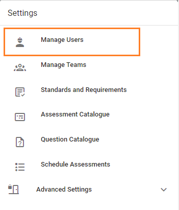
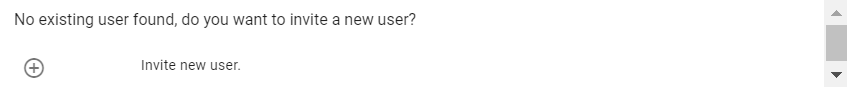
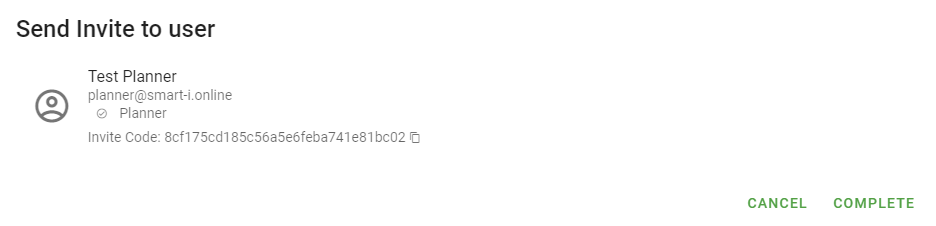
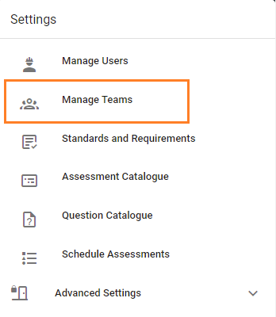
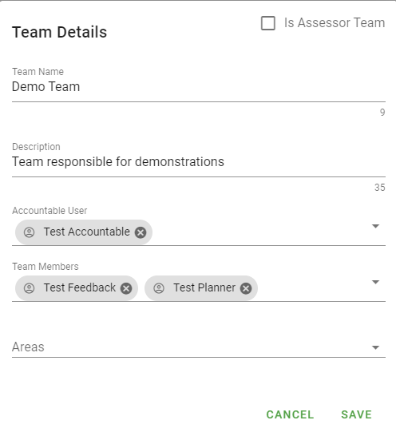

# Manage Users and Teams
> Managing users and teams may only be completed by a system or company administrator.

## Manage Users
Navigate to the Users page
1. Log in as a user with administrative privileges.
1. Navigate to the "Settings -> Manage Users" menu option

### Add User
1. To add a new user click the _INVITE NEW USER_ button.
1. Enter a name or email address. If the name or email address is not found, you will be prompted to invite a new user.

1. Fill in the name and email address, select the user role/privileges, click _SAVE_.
1. The newly created user will be listed as _pending_.
1. Click the send invite icon . You will then be prompted to send an invite.
. Click COMPLETE.
1. The user has been added.

The user will receive an email with instructions to [activate their account](../jobs/create-account.html).

### Edit User
1. To edit an existing user, click the edit icon  next to that user.
1. You are able to edit the display name, and change privileges.
Available privileges (or roles) are: Company Admin, Team Admin,
Assignment Admin, Assessor, Planner.
1. Click _SAVE_ when done.

## Manage Teams
Navigate to the Teams page
1. Log in as a user with administrative privileges.
1. Navigate to the "Settings -> Manage Teams" menu option

### Add Team
1. To add a new team click the _NEW TEAM_ button. This will display the Team Details dialog.

1. Complete details:
    1. Team name
    1. Description
    1. Select the Accountable User
    1. Select Team Members
    1. Select Area (optional)
1. If the team is an Assessor Team, check the Assessor box.
1. Click _SAVE_.

### Edit Team
1. To edit an existing team, click the edit icon 
1. You are able to edit the display name and description, change team members, change areas.
1. To change the Accountable user, deselect the existing user and select the new user from the drop down menu.
1. To add/delete team members, select or deselect users from the drop down menu.
1. To add/delete areas, select or deselect areas from the drop down menu.
1. To change if the team is an Assessor team, check or uncheck the Assessor box.
1. Click _SAVE_ when finished.