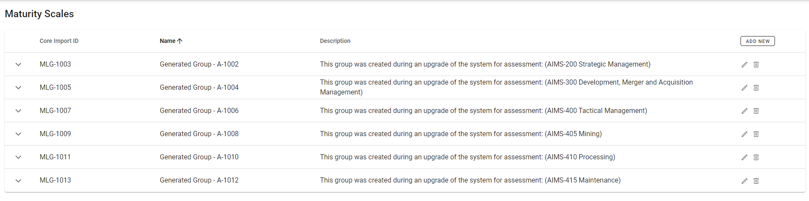

# Maturity Scales
Creating and managing maturity scales is completed via the Maturity Scales page, which is accessed from the menu via Settings -> Maturity Scales.

All configured maturity level scales or groups will be displayed.

Click on the down chevron to display configured maturity levels within a group.

## Edit existing maturity scale
Click the corresponding edit icon  to edit an existing maturity scale or group.

The core import id is a unique identifier used when importing and exporting data.
Click _SAVE_ when done.

### Add new maturity level
To add a new maturity level to a maturity scale or group, click the _ADD NEW_ button for that scale.

Set the desired level (numerical), name, and description, as well as the colour.

Click _SAVE_ when done.  
The new maturity level will appear in the scale.

### Edit existing maturity level
Click the edit icon  to edit an existing maturity level with a maturity scale or group.

From this dialog you may edit the Level, Name, Description, and select the colour.

After selecting the desired colour, click _DONE_. 
 
Click _SAVE_ to save changes to the maturity level.

### Delete maturity level
Click the delete icon  to delete an existing maturity level from within a maturity scale or group.

You will be asked to confirm deletion of maturity level.

## Add new maturity scale
Click the _ADD NEW_ button at the top to the page.

A core import id will be automatically generated. This is a unique identifier used for import and export of data.  
_Note: You may set the core import id manually, but must ensure it is unique._   
Set the name and description for the new maturity scale, then click _SAVE_ when done.

The newly created maturity scale will appear in the list.

Now maturity levels may be defined and added to the maturity scale by clicking the _ADD NEW_ button. Follow the same procedure as described above for adding a new maturity level.