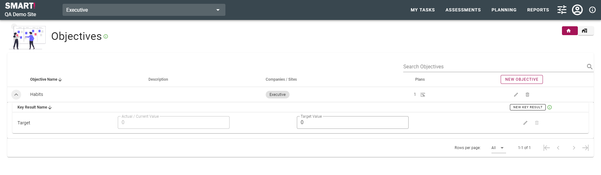

# Create an objective
All objectives are created and managed through the Planning module. To access objectives, select _PLANNING_ from the menu bar and click on _OBJECTIVES_. 

To create a new objective click the _NEW OBJECTIVE_ button.

Add the details as prompted - name, description, select the company/companies and hit _SAVE_.

Once you have created an objective you can then create key results and plans or initiatives.

Key results at the objective level do not have any time base. They are able to be used as a snapshot, but do not allow for history or tracking. Normally, you would have initiatives sitting at the level below with actions attached to them so you can track how the objective is being achieved. Then the objective gives you a snapshot of where you are, with the initiatives showing the history and future planning.

To create a key result at the objective level, expand the objective under which you wish to add the key result, and click _NEW KEY RESULT_.

Complete details as prompted.

The type and summary method for the key results must be selected. Units are optional.  
 
Type: number, percent, boolean (yes/no), or rating.   
Summary method: average or sum.

Key results at the objective level are able to be updated or modified from this page.

If you make changes to the values or key results, you will be prompted to save.

To create or associate a plan or initiative with the objective, you can navigate to the [Initiative / Plan](jobs/plan.md) page via the menu, or click on the plan icon.

