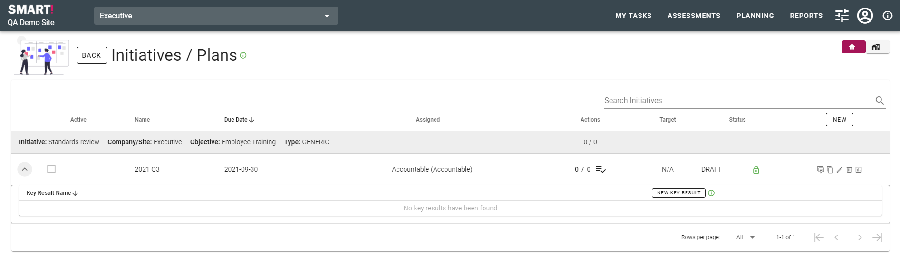

# Create a plan
All plans or initiatives are created and managed through the Planning module. To access plans, select _PLANNING_ from the menu bar and click on _INITIATIVE / PLAN_. 

>NB: The planning module must be enabled, and users set up to use the planning module, by a system administrator. If you are unable to access the Planning modeule, please check with your system administrator that it has been enabled and you have access.

You may have multiple plans, however only one plan may be active at any one time. The key results available are based on the current plan only.

Plans must be associated with an objective, and cannot be created without first [creating an objective](jobs/objective.md).

There are two types of plans - maturity plan, and generic plan.

## Maturity Plan
A maturity plan is linked to assessments and the maturity scores and targets are set based on those assessments. 

To create a new maturity plan, click NEW on the right of the screen. A dialogue will be shown prompting you to enter details for the plan.  
Step 1: Enter details of the plan  

If you have navigated to the Initiatives page from [Objectives](jobs/objective.md) the linked objective field within any plan you create will be pre-populated.

Initiative group is the plan time horizon, e.g., weekly, monthly, yearly, etc.

Give the initiative a name and description, label, select the accountable team and select the due date.

Click NEXT to advance to the next step in creating a plan.

Step 2: Select assessments  
  
Check the box against the assessment(s) you wish to use for this initiative.  

Click NEXT to advance to the next step in creating a plan.

Step 3: Assign actions  
  
A list of all actions within the assessment(s) selected in the previous step is displayed. Check the box against unassigned actions to assign them to the initiative. Click DONE when finished.

Your maturity plan has been created.  

Once a plan has been created,  [key results](jobs/key-results.md) may be added.

## Generic Plan
A generic plan has key results, and initiatives that have key results, but it is not linked to the assessments.

To create a new generic plan, click NEW on the right of the screen. A dialogue will be shown prompting you to enter details for the plan.

Step 1: Enter details of the plan. For a generic plan, ensure you click _Generic Initiative_. 

If you have navigated to the Initiatives page from [Objectives](jobs/objective.md) the linked objective field within any plan you create will be pre-populated.

Initiative group is the plan time horizon, e.g., weekly, monthly, yearly, etc.

Give the initiative a name and description, label, select the accountable team and select the due date.

Click _SAVE_.

Your generic plan has been created.

Once a plan has been created, [key results](jobs/key-results.md) may be added.