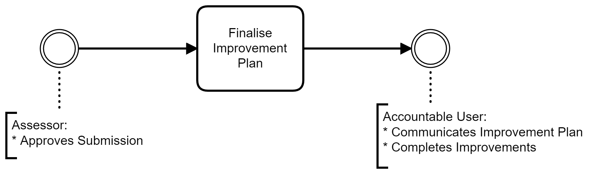

# Planner 
The planner is responsible for taking the actions created in the system and planning the execution of closing the identified gaps. The planner also needs to determine if the created actions do in fact adequately close the identified gaps.
>The role of planner is often filled by the assessor.

## Tasks
- Create [Objectives](../jobs/objective.html)
- Create [Initiatives / Plans](../jobs/plan.html)
- Create [Key results](../jobs/key-results.html) (Metrics), these are the lead and lag measures that show if the initiative and ultimately the objective will be successful.
- Manage Actions that form part of the plans

## Workflow
