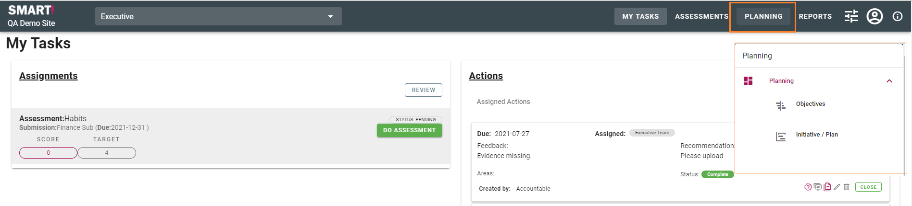
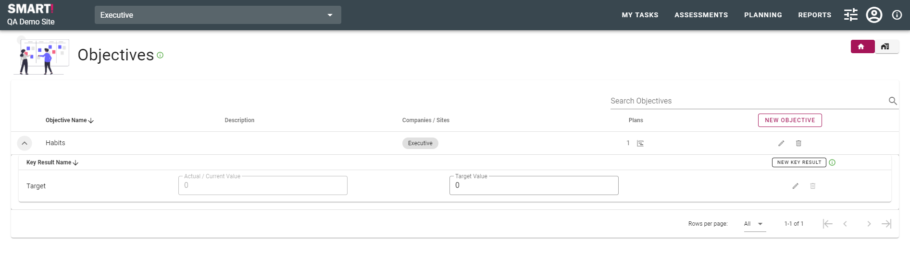
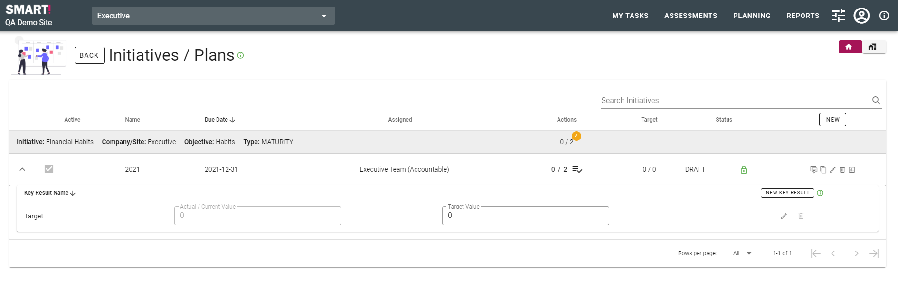

# Planning based on OKRs
The SMART! planning module is based around the concept of OKRs (Objectives and Key Results). OKRs are a fairly simple framework for tracking and implementing things that you want to do.

The planning module consists of two areas - Objectives and Initiative / Plan. These are accessed from the menu on the top right of your screen, clicking Planning then selecting either Objectives or Initiative / Plan.

## Objectives
Within the Objectives area you are able to view and search existing objectives, create new objectives, add key results and edit objectives and key results.

## Initiatives
Within the Initiatives / Plans area you are able to view and search existing plans; create new plans; and view, edit and create key results. 
