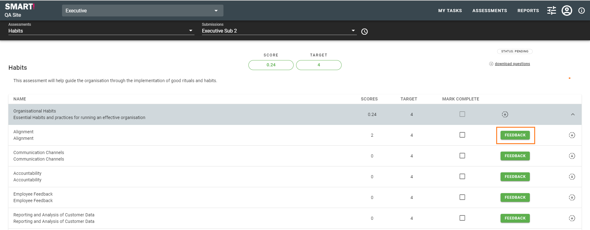
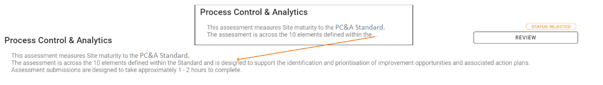
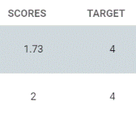
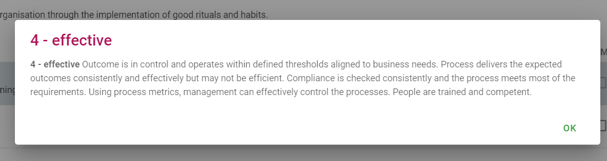
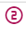
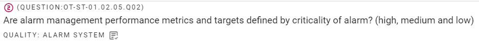
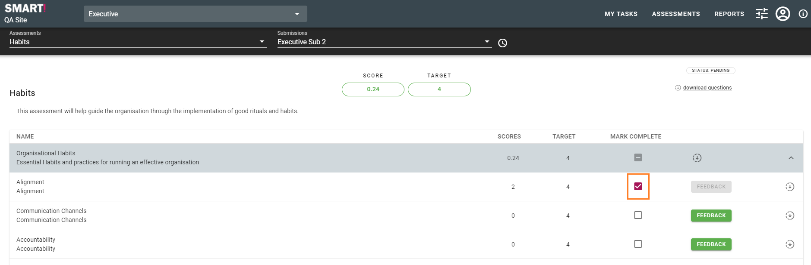

# Providing Feedback
Click on the _GIVE FEEDBACK_ button from the My Tasks dashboard or from the menu bar select _ASSESSMENT -> COMPLETE_. You will be shown the submission details that can be completed.

Click on the _"FEEDBACK"_ button to work on that section of the submission. Once you have answered all the questions you are able to for this submission click on the "MARK COMPLETE" check box next to the _"FEEDBACK"_ button to indicate that you are done with that section.

Starting from the top left of the screen you are able to select the assessment and the submission that has been assigned to you as a user.

You can see the assessment name and description. (If the description is longer than the space available you will see **...** this indicates that the description has been truncated. You can simply click on the description to see the full description).

Clicking on the score or target will show a dialog with the description for the maturity level.

## Answering Questions
Once you have entered the assessment questions page you are shown a list of questions for a specific maturity level. Assessments can have one or more maturity levels.

Once you are able to answer all questions on a maturity level as "Yes" then the maturity score will increase. A score of 2.4 for instance indicates that you are currently on a maturity level 2 and you have answered 40% of the maturity level 3 questions as "Yes". Answers for higher-level maturity levels are not shown and do not affect the score until the current maturity level has been completed. (Reports are able to extract these additional results if they are needed).

[2nd Line Assurance](/concepts/second-line-assurance.html) questions display a specific  icon to identify them.

The requirements linked to a specific question can be accessed by clicking on the  icon next to the quality name.

Answering the question is only the first piece of completing the submission. Adding comments is probably the most important component of providing feedback.

Click on "NEXT" to keep going with the submission or "EXIT" to return to the Assessment summary page.

## Finalising an Assessment (Submission)
Once all questions that can be answered have been answered (including adding comments), mark that section of the assessment as **Complete**.

