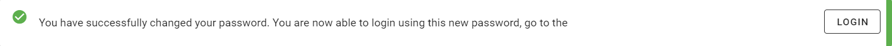

# Resetting your password

At the login screen, click the _"FORGOTTEN PASSWORD?"_ button.

You will be directed to a page to enter your email address.

Click _"TRIGGER PASSWORD RESET"_ to email

An email will be sent to the entered email address.

Click the link, or copy and paste the url into your browser.

You will be prompted to enter your email address and a new password.

Click _"CHANGE PASSWORD"_.

Click the _"LOGIN"_ button to take you to the login screen.

Login using the new password.