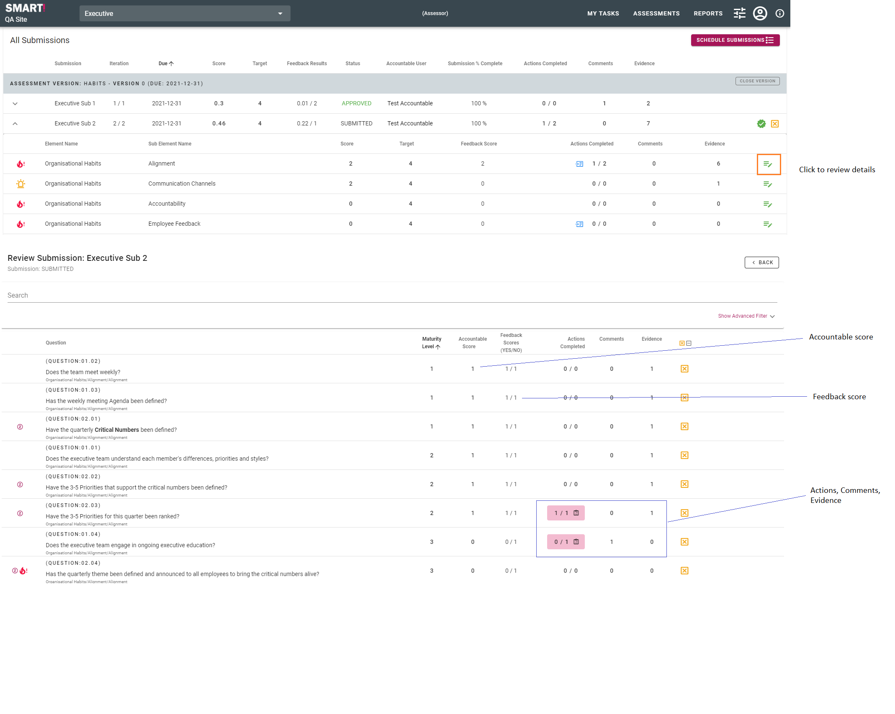

# Reviewing Feedback
As part of the assessment process, feedback may be requested on a submission. 

Feedback users will answer questions and provide comments. They are also able to view uploaded evidence. 

Any feedback provided is then considered by the Accountable and Assessor users when they review the submission prior to approval.

To review a submission, navigate to the Review page by clicking the REVIEW button in the Assignments section of My Tasks, or selecting Assessments -> Review from the menu bar.

Feedback responses are displayed, along with any comments added.

