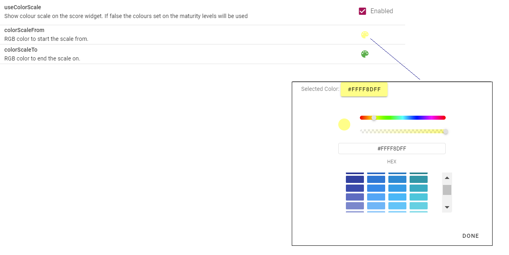

# Rule Profiles  
_A collection of settings which can be applied to a version or a submission._
>NB: These settings require System Administrator privileges.  
All changes are saved as you make them.

Multiple rule profiles may be configured. Once configured, they may be applied to an assessment (when adding a version, or scheduling assignments). The applied rule profile may be changed at any time, however changing the rule profile or settings should be done with caution as it may impact any existing submissions.

Rule profiles are configured via Advanced Settings -> System Settings -> Rule Profiles.

## Discrepancy Error Level
>content coming soon

## Discrepancy Warning Level
>content coming soon

## Non Comply Prompt
There are three options for this setting:
- No prompt
- On 2nd line assurance only
- On all

## Non Comply Stop Approval
When enabled, this setting stops the assessment or submission from being approved or closed if there are any non-complying elements.

## Show Evidence Required
>content coming soon

## Stop on Fail  
When enabled, this setting means the assessment cannot progress unless the maturity level has passed.  
Thresholds are able to be set within the assessment.  
For example, the threshold may be set for 70%. This means 70% of the questions within maturity level 1 must be answered _YES_ in order to progress to maturity level 2.
 
## Reset Scores  
Assessment scores are able to be reset under certain circumstances. This is used when you don't want to carry the scores over from the previous version.  
There are four options for this setting:
 - No reset (default)
 - Automatically reset on approval and close
 - Prompt Assessor on approval and close
 - Prompt Accountable on first load

Actions, evidence, and comments associated with questions are **NOT** reset when scores are reset.
 
## Use Colour Scale
The colour scale for the score widget (displayed in the top right corner when completing a submission) may be set to automatically grade between two colours, or colours for maturity levels may be set individually.  
When enabled, you are able to set the from and to colours.

When disabled, colours for maturity levels may be set via the Assessment Cataloge -> Edit Assessment -> Maturity Levels

