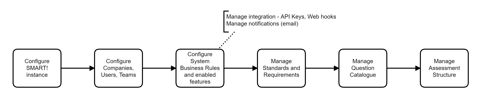

# System Administrator

The system administrators maintain the functions that have system wide impact. Many of the configuration aspects of the SMART! application can only be done as the SysAdmin.

> NB: The system admin account should only be used for configuration and never assigned to assessments or teams. 

## Tasks
- [Configure SMART! instance, customising display](/jobs/configure-instance.html)
- [Configure companies](/jobs/configure-companies.html)
- [Manage users and teams](/jobs/manage-users.html) 
- [Manage system business rules](/jobs/rule-profiles.html) and enabled features
- [Manage Standards and requirements](/jobs/manage-standards.html)
- [Manage Assessment structure](/jobs/manage-assessment.html)
- [Manage Question Catalogue](/jobs/manage-questions.html)
- [Manage Maturity Scales](/jobs/maturity-scales.html)
- [Manage Qualities](/jobs/manage-qualities.html)
- Manage integration (API keys, Web hooks) 
- [Manage notifications (Email)](/jobs/manage-notifications.html)
- [Manage status and workflows](/jobs/manage-status-workflows.html)

## Workflow
