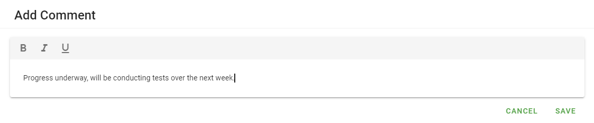
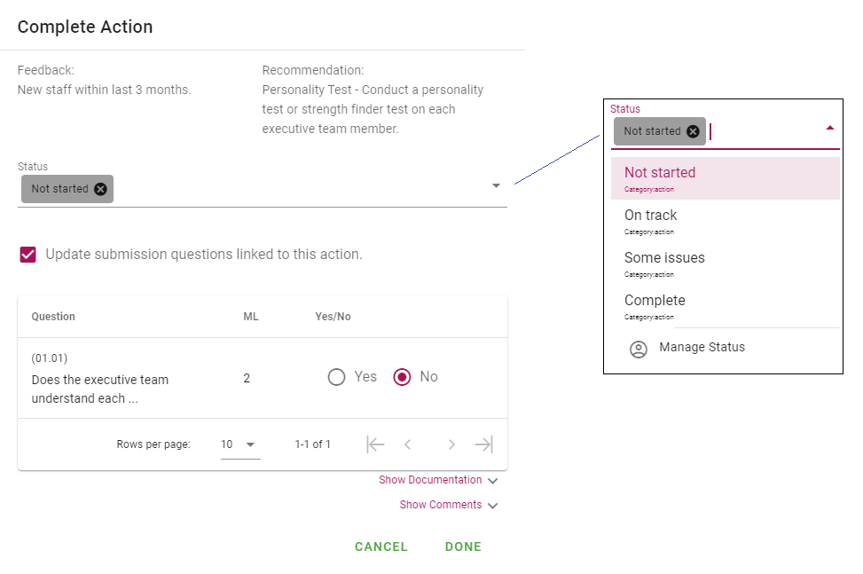
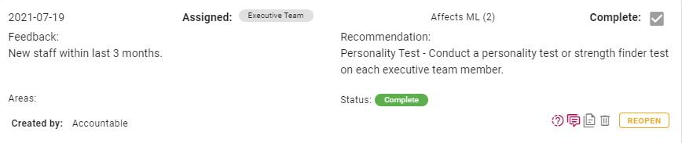
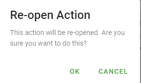

# Updating actions

As actions are undertaken and completed, it is important to keep track of their progress, particularly if they form part of a plan.  
Updating the status of an action may be completed from the My Tasks page, or by accessing through a submission.

All actions assigned to a user are displayed in the Actions area of My Tasks (landing page)

Actions are able to be sorted by clicking on **Sort by** and selecting the desired category.
 

Each action displays the following information: Due, Assigned to, the maturity level this action affects, whether it is complete or not, Feedback, Recommendations, Areas, who created the action, action status. There are also a number of icons and a **CLOSE** button.

When clicked, the icons allow you to perform various functions. Icons will be displayed as pink when there are associated items.

The question icon  will display details of the question the action is attached to.

The comment icon  will display any comments associated with the action. 

You may also add new comments by clicking on **NEW COMMENT**. Simply type your comment in the dialogue box and click **SAVE** when complete.

Comments may be edited or deleted by clicking the appropriate icon.

The documentation icon  will display any documentation associated with the action. Documentation may be in the form of a file or a link.

New documentation may be added by clicking either **ADD LINK** or **SELECT FILES**.

The edit icon  allows you to edit the action, including updating action status, as well as adding comments and documentation (click on **Show Documentation** or **Show Comments** to display).

Text within the Feedback and Recommendation fields are able to be edited. Assigned Team, Area, Due Date and Status can be changed by selecting from the drop-down menus.

The delete icon  will delete the action. You will be prompted to confirm prior to deletion.
  

Clicking on the **CLOSE** button will open the _Complete Action_ dialogue.

From here, you can update the status and update submission questions linked to the action.
Clicking **DONE** will close the action which is displayed in My Tasks as shown.

You can see the button which as previously **CLOSE** now reads **REOPEN**, and the Closed checkbox is ticked. Upon clicking **REOPEN**, you will be asked to confirm the reopen action.

Clicking **OK** will reopen the action. The Complete checkbox will be unticked, and the **REOPEN** button revert to **CLOSE**. No other settings are modified. 