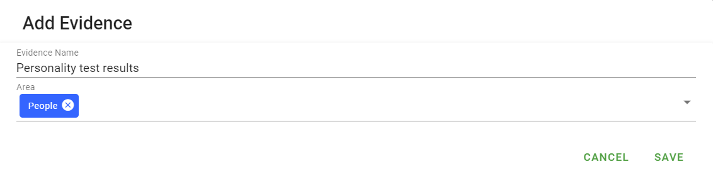
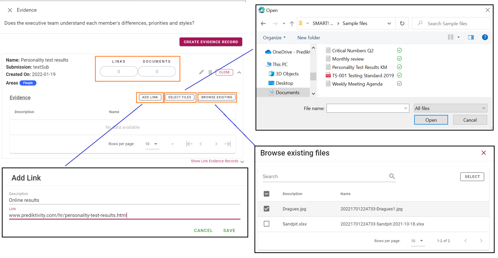
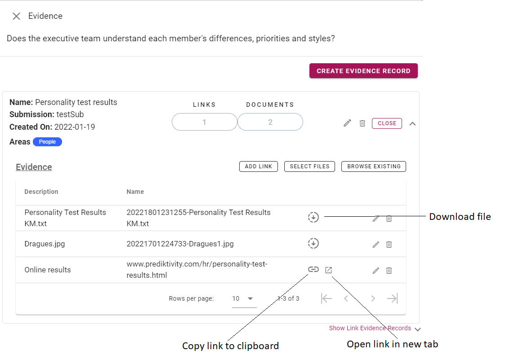

# Uploading evidence

When completing an assessment, it is important to provide evidence for those questions you answer as _YES_. If you do not provide evidence, this may result in errors or warnings at the review stage, and ultimately the assessment being rejected.

To upload evidence related to a question, click on the evidence icon .  This will open a dialog window. 

You have two options: create a new evidence record, or link an existing evidence record.

## Create new record
Click _"CREATE EVIDENCE RECORD"_.  
  
Add a name for the evidence record, and click _"SAVE"_. This creates the record. 

Links or documents may be added/uploaded to the evidence record by clicking on the Links or Documents fields, or the down arrow to reveal the buttons _"ADD LINK"_, _"SELECT FILES"_ and _"BROWSE EXISTING"_.
  

### Add link
Click the _"ADD LINK"_ button. 
Fill in the details, and click _"SAVE"_.
A link has been added to the evidence record.

### Select files
Click the _"SELECT FILES"_ button.  
Browse to the file(s), select and click _"OPEN"_.  
Selected files will be shown as _pending_. Click the _"UPLOAD"_ button to add the file(s).

### Browse Existing
Browse Existing allows you to select files that have been previously uploaded. Click the _"BROWSE EXISTING"_ button. Search for the required file(s) using the search bar, or select from the list shown. Select the desired file(s) via the checkbox on the left, then click _"SELECT"_. 
 
Selected files will be shown as _pending_. Click the _"UPLOAD"_ button to add the file(s).

Once an evidence record has been created with links or files, you are able to edit via the  icon. Links are able to be copied, or opened in a browser, and files are able to be downloaded.

The evidence record, or link, or file may be deleted via the  icon.

## Link to existing record
Click _"Show Link Evidence Records"_.  
Select the existing evidence record you wish to link to, and click _"LINK"_.  

