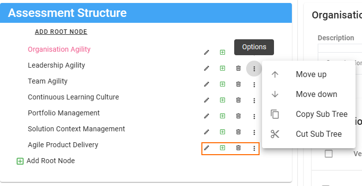

# Create Assessment
This page will describe the process of creating a new assessment. Each of the options will be explained as that are reached.

## Catalogue
The assessment catalogue is accessed from the main menu 'Assessment -> Configuration -> Catalogue'
The catalogue shows all the assessments available to this instance of smart!.
If you want to use an assessment make sure you have the correct site selected, then click on the "ADD TO COMPANY" button.
That will make the assessment available to that site.

In this document we are going to focus on creating a whole new assessment.

## Create New
Start by clicking on the "ADD NEW" button.
The following screen is shown in the right panel.

* TIP: expand the panel to full screen

### Configuring an assessment
* Name: the assessment name and version must be unique
* Active: this is false by default when creating a new assessment. This is because you need to add a structure and verifications to the assessment before it is usable. Best practice is to create the assessment and only when you are done, set the assessment to active.
* Core Import Id: this is a unique identifier that is only used during assessment import and export. The is allows a exported version of the assessment to be imported to another instance. __NB:__ if the import finds a matching assessment it will override that assessment. So make sure you have a good naming convention
  - Example is A-XXX-01 (A: assessment, XXX: abbreviation of you standard or policy etc, 01: version of the document)
* Category: a handy label that can be used to group multiple assessments together. E.g. ESG, Standards, Policies, Meeting Checklists etc
* Show Documentation: you are able to link or upload documentation to the assessment. This is really help ful if you the assessment is based on a standard or if you want provide some training documentation that can be reviewed by users of the assessment. The documentation is available from the main submission list page.
* Version Label: as mentioned on the name field, name and version are required to be unique

### Settings
* Renew Period: some assessment need to be renewed as they have a cost associated __FUTURE FEATURE__
* Price: __FUTURE FEATURE__
* Description: description of the assessment and it's purpose
* Single User Assessment: __FUTURE FEATURE__
* Enable Standard Association: __FUTURE FEATURE__
* Use Maturity Scale: Maturity scales allow you to calculate a score using maturity. The smart! allows you the ability to create your own maturity scale, or use a score as a maturity rating. 

    - if you choose NONE: then you have decided that this assessment is not using a maturity levels to determine scores and an average score will be used across verifications. (only verifications that are set to be included in the scoring will be used)

#### MATURITY SCALE
This indicates that you have created a specific maturity scale in the system and you want to use that to group your verifications and perform score calculations
 
 * Select Maturity Scale: Choose the predefined maturity level from the list
 * Display type: WIZARD or SINGLE page. The WIZARD means all verifications of a specific level will be grouped together on a page. You will then need to navigate NEXT or BACK to see the higher and lower levels of the maturity scale. WIZARD is the default view for maturity assessments. 
 SINGLE PAGE will show all the verification for the assessment on a single page ordered by maturity level.

#### SCORE SCALE
 In this case you want the score you use to reflect the maturity level. This normally takes the form of a rating.
 
 * Max Score as Maturity: what is your max maturity score? if you had a maturity scale it would be to highest level. As many of these are based on rating type questions what is the hightest rating e.g. 4. if you use other field types they will max out at this value.

### Non Conformance Rules
Non conformance, is related to how verifications are answered and if they have evidence and/or actions associated with them.
By default the non-conformance is disabled.
Enable Non-conformance checks: turn on the non-conformance business rules

* Prompt: When you try to move NEXT, BACK or EXIT a assessment if there is a non-conformance present you will be shown a prompt
  - NONE: no prompt
  - MANDATORY: Only show the non-conformance for mandatory verifications only
  - ALL: show non-conformance for all verifications
* Maturity Level: this is only available if you are using a maturity scale. Choosing a maturity level means the non-conformance checks will only be done for that level and lower levels.
* Show non-conformance icons: a error or warning icon will appear next to verification that have a non-conformance
* Select when to show icons: NONE: don't show icons, MANDATORY: only show icons for mandatory verifications, ALL: show for all verifications
* Stop on fail: this only applies when you are using a maturity scale and it is displayed as a wizard. You will not be able to move to the NEXT maturity level if you have any active non-compliance on the current level. 

### Close and Reset Configuration
When you close a submission, what do you want to do with the results, evidence and actions on the submission being closed.
* Score Reset: do you want to reset the scores 
  - NONE: No reset
  - AUTOMATIC: Automatically reset the scores on close, this will create a new submission with no answers, no evidence and no actions.
  - PROMPT: when you close the submission dialogue will be shown allowing you to choose if you want to clear the results, keep the actions and/or evidence.

### Workflow Configuration
Workflows determine the statuses and permissions a submission will go through. For example when you approve a submission you should no longer be able to edit the submission. The workflow will control this. By default all submissions use the "BASE Submission Workflow - Assessor Approval v1" this workflow is designed to have one group of people (Accountable, Consulted, Responsible) to complete the assessment and then another group of people (Assessors) to review and approve the submission.

Submission have a close dialog that should be shown to allow people to close one submission and create a new follow on submission.
The __Dialogue Triggers__ determine what status will trigger this dialogue to be displayed.
By default the Assessor will trigger the dialogue when they try to transition the status to APPROVED. 

### Assessment Structure
The core of an assessment are the verifications.
The assessment structure helps us organise the structure in to logical sections.
If you are creating the assessment from scratch you may see this alert

This means you need to save the above setting before you can start added the structure. Click on the "Quick Save" button.

The assessment structure builder provides a hierarchical view of the structure. You need to have a top level set of sections called "Root Nodes"
When you use the summary report the score will be shown by each root node.

This means choosing a meaningful set of root nodes is really important.
Click on the node name to show the right hand verification details.

The node structure can have as many sub node as you would like simply click on the green "+" icon to add a subnode.
Edit will change the node title
Delete will delete the node and all sub nodes from the assessment
Using the ellipse menu you are also able to move nodes and whole sections of the structure around.

#### Verifications
[Verification Options](/v3/assessment/verifications.md)

If you use the "Add New" button you will be shown the full verification add dialogue.
You can quickly add using the "Quick Add" option. This option will create a verification with default values for most options.

Bulk add verifications allows you to prepare verifications in a text editor and then copy and paste them to create the verifications.

The required format is specified on the dialog but and example would be

"BOOLEAN|TRUE|Can the cut-off values assumptions be applied by a peer reviewer and replicate the cut-off values?|FALSE||TRUE|FALSE|1" 

__NB:__ each verification must only be one one row if you have new line characters in the text it will fail to import.

#### Next Steps

#### Required Evidence

## Done
Once you have added all the verifications, save the assessment and you are ready to create some submissions.
