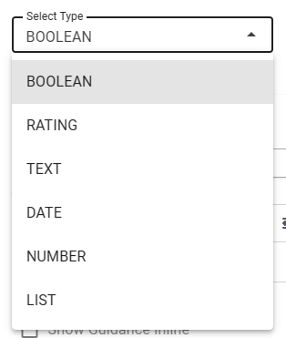
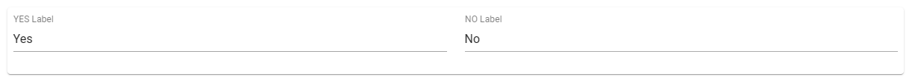
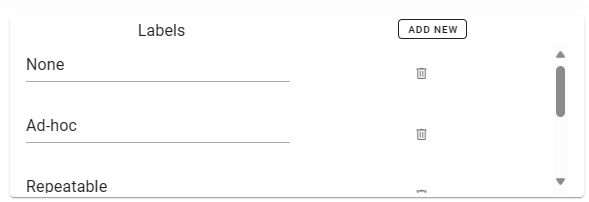
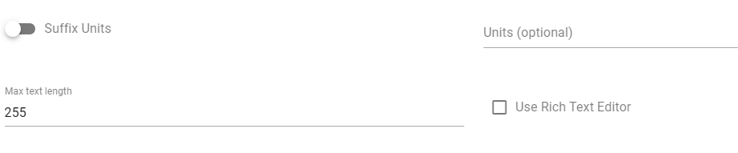
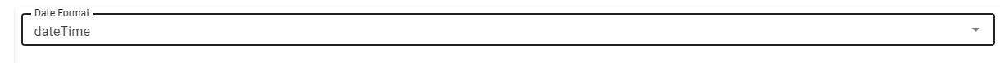
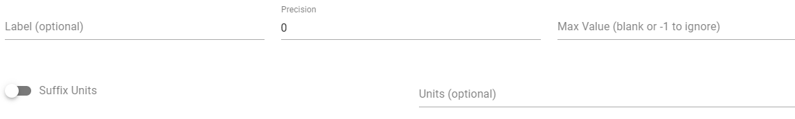
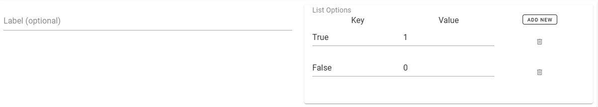

#### Verifications
Verifications are the heart of the assessment and how data is gathered.
Verifications can have multiple types

Each verification type has different options.

##### Boolean
This is the simple Yes/No style verification. It is rendered as a radio button with the labels Yes and No.
__Options__

##### Rating
The rating will be rendered as a rating scale of stars. Each option added will increase the size of the rating.
The example below has 3 labels which will show a 3 star rating scale with these labels as a tooltip.

##### Text
The text field will be rendered as a text entry or a rich tech box allowing formatting of the text.

##### Date
Date field rendered as a date picker, you are able to specify the format of the date.

##### Number
Number fields are rendered as a number input and you are able to define the precision, units and max value limit

##### List
List is rendered as a select list showing the key value pair as the options in the list.

